Example 1: Overview of the *Fermi* Data
=======================================

This example provides an overview of the *Fermi*-LAT gamma-ray data we
have included with the code, which provide the testing ground for the
examples in later notebooks.

**We emphasize that NPTFit is applicable much more generally. The code
package can be implemented in any scenario in which the data is measured
in discrete counts.** We use the example of *Fermi* data here, as it
represented some of the earliest applications of this code and also it
is fully publicly available, see
http://fermi.gsfc.nasa.gov/ssc/data/access/

The specifics of the dataset we use are given below.

+--------------------+-------------------------------------------------------------+
| Parameter          | Value                                                       |
+====================+=============================================================+
| Energy Range       | 2-20 GeV                                                    |
+--------------------+-------------------------------------------------------------+
| Time Period        | Aug 4, 2008 to July 7, 2016 (413 weeks)                     |
+--------------------+-------------------------------------------------------------+
| Event Class        | UltracleanVeto (1024) - highest cosmic ray rejection        |
+--------------------+-------------------------------------------------------------+
| Event Type         | PSF3 (32) - top quartile graded by angular reconstruction   |
+--------------------+-------------------------------------------------------------+
| Quality Cuts       | ``DATA_QUAL==1 && LAT_CONFIG==1``                           |
+--------------------+-------------------------------------------------------------+
| Max Zenith Angle   | 90 degrees                                                  |
+--------------------+-------------------------------------------------------------+

.. code:: python

    # Import relevant modules
    
    %matplotlib inline
    %load_ext autoreload
    %autoreload 2
    
    import os
    
    import numpy as np
    import healpy as hp

Downloading the data
--------------------

The *Fermi* data used here can be downloaded from
https://dspace.mit.edu/handle/1721.1/105492 along with a ``README``
detailing the data. The following commands automatically download and
set up the data on a UNIX system:

.. code:: python

    # Assumes wget is available! Otherwise, use curl or download manually 
    # from https://dspace.mit.edu/handle/1721.1/105492
    os.system("wget https://dspace.mit.edu/bitstream/handle/1721.1/105492/fermi_data.tar.gz?sequence=4");
    os.system("tar -xvf fermi_data.tar.gz?sequence=4");
    os.system("rm -r fermi_data.tar.gz*");

The Data - Map of Gamma-ray Counts
----------------------------------

The data we have provided is in a single energy bin, so only spatial
information of the photons remains. We bin this into an ``nside=128``
healpix map. This map has units of [photon counts/pixel]. The data is
shown below on two scales, the second making it clear there are pixels
with large numbers of counts - there are very bright gamma-ray sources
in the data.

.. code:: python

    counts = np.load('fermi_data/fermidata_counts.npy')
    
    hp.mollview(counts,title='Data counts',max=100)
    
    hp.mollview(counts,title='Data counts (no max)')

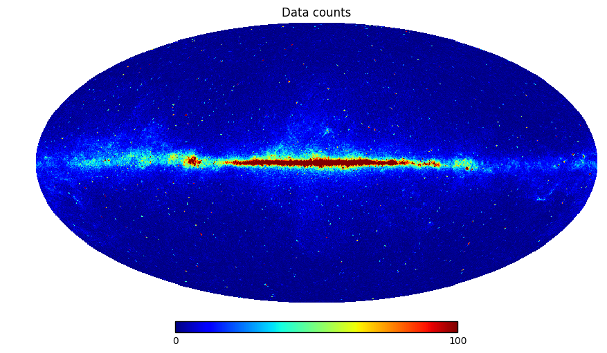

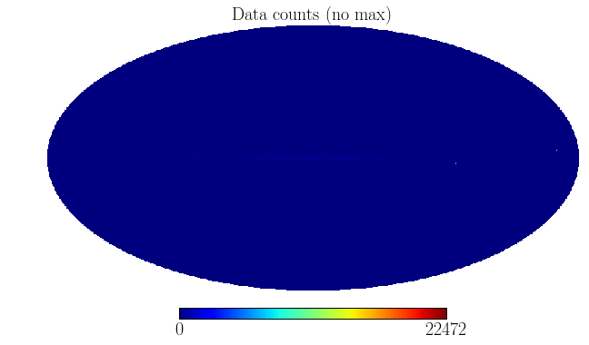

To see the detailed structure in the map, we also mock up a logarithmic
version of the data.

.. code:: python

    nonzero = np.where(counts != 0)[0]
    zero = np.where(counts == 0)[0]
    counts_log = np.zeros(len(counts))
    counts_log[nonzero] = np.log10(counts[nonzero])
    counts_log[zero] = -1
    hp.mollview(counts_log,title='Data counts - Log')

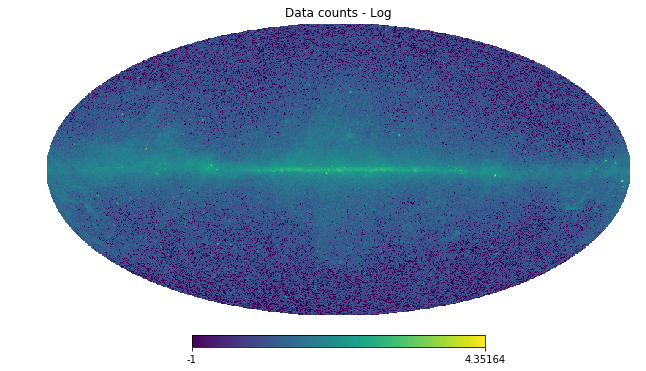

Exposure Map - Map of where *Fermi*-LAT looks
---------------------------------------------

*Fermi*-LAT is a space based telescope that takes data from the entire
sky. Nevertheless it does not look at every part of the sky equally, and
the exposure map keeps track of this.

The natural units for diffuse astrophysical sources is intensity
[counts/cm:math:`^2`/s/sr], whereas for point sources we use flux
[counts/cm:math:`^2`/s]. Neither of these knows *Fermi* was pointing.
But *Fermi* measures counts or counts/pixel, and this is also the space
in which we perform our statistical analysis. The mapping from
[counts/cm:math:`^2`/s(/sr)] to [counts(/pixel)] is performed by the
exposure map, which has units of [cm:math:`^2` s].

.. code:: python

    exposure = np.load('fermi_data/fermidata_exposure.npy')
    
    hp.mollview(exposure,title='Fermi Exposure [cm$^2$ s]')

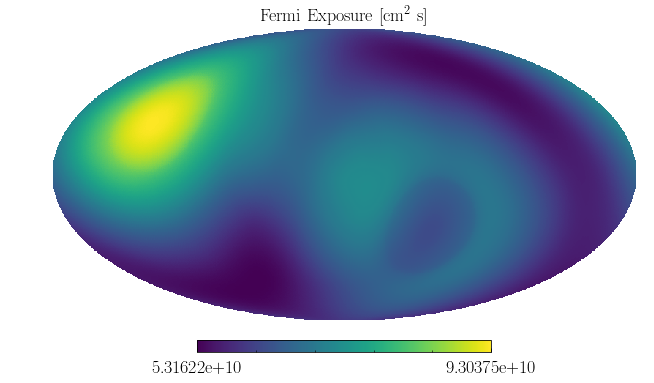

When performing an NPTF, technically the non-Poissonian templates should
be separately exposure corrected in every pixel. Doing this exactly is
extremely computationally demanding, and so instead we approximate this
by breaking the exposure map up into regions of approximately similar
exposure values.

For the Fermi instrument a small number of exposure values (set by
``nexp`` at the point of configuring a scan) is often sufficient, as the
exposure is quite uniform over the sky. For datasets with less uniform
exposure, however, larger values of ``nexp`` are recommended. We show a
run performed with ``nexp != 1`` in Example 4 and 10.

Below we show how the sky is divided into different exposure regions -
try changing ``nexp``.

**NB:** In the actual analysis the exposure region division is done
within the specified ROI, not the entire sky

.. code:: python

    # Number of exposure regions - change this to see what the regions look like when dividing the full sky
    nexp = 2
    
    # Divide the exposure map into a series of masks
    exp_array = np.array([[i, exposure[i]] for i in range(len(exposure))])
    array_sorted = exp_array[np.argsort(exp_array[:, 1])]
    array_split = np.array_split(array_sorted, nexp)
    expreg_array = [[int(array_split[i][j][0]) for j in range(len(array_split[i]))] for i in range(len(array_split))]
    temp_expreg_mask = []
    for i in range(nexp):
        temp_mask = np.logical_not(np.zeros(len(exposure)))
        for j in range(len(expreg_array[i])):
            temp_mask[expreg_array[i][j]] = False
        temp_expreg_mask.append(temp_mask)
    expreg_mask = temp_expreg_mask
    
    for ne in range(nexp):
        hp.mollview(expreg_mask[ne],title='Fermi Exposure Region '+str(ne+1),min=0,max=1)

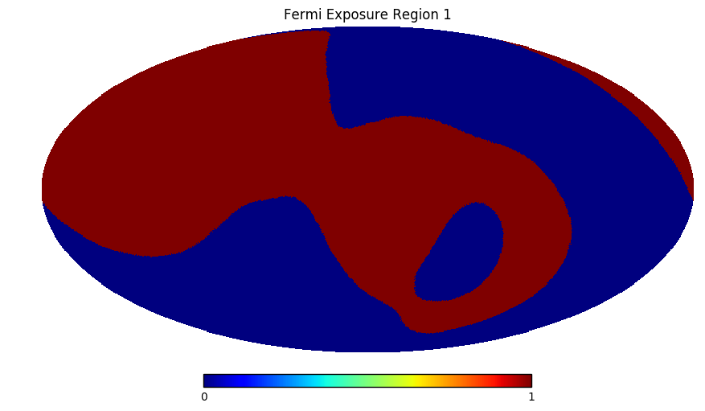

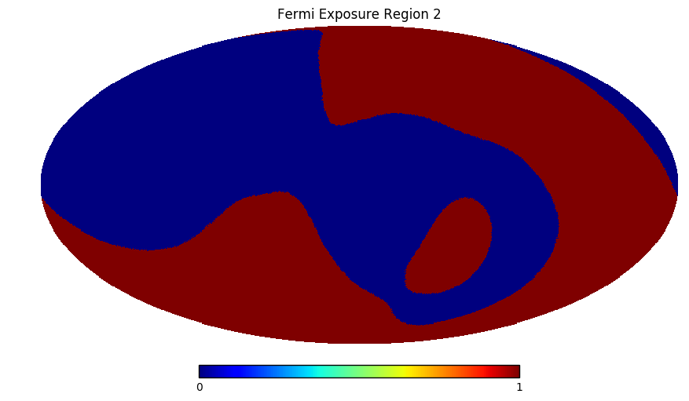

Point Source Catalog Mask
-------------------------

We also include a mask of all point sources in the 3FGL, as well as
large extended objects such as the Large Magellanic Cloud. All point
sources are masked at 95% containment as appropriate for this ``nside``.
The map below is a mask, so just a boolean array

Note that with the NPTF it is not always desirable to mask point sources
- we can often simply use a non-Poissonian template to model them.

.. code:: python

    pscmask = np.load('fermi_data/fermidata_pscmask.npy')
    
    hp.mollview(pscmask, title='Point Source Catalog Mask')

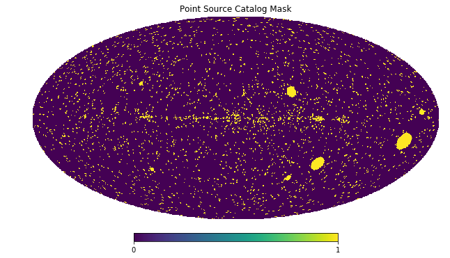

Templates - Spatial Models for the Fermi Data
---------------------------------------------

Next we show the different spatial templates that we will use to model
the above Fermi data. These also represent examples for the types of
models we can use as a basis for either Poissonian or non-Poissonian
templates.

**Note that templates given to the NPTF must be exposure corrected. That
is they should be models of counts, not flux. Furthermore they should
also be smoothed to account for the PSF if necessary.**

In addition to exposure correcting the maps, for each template below we
have also adjusted it so that it has mean 1 within an ROI defined by
:math:`|b|>2^{\circ}` and :math:`r<30^{\circ}`.

Diffuse Emission
~~~~~~~~~~~~~~~~

Firstly we show a model for the diffuse emission, which arises mainly
from three sources: 1. protons hitting the gas, giving rise to pions
which then decay to photons (:math:`pp \to \pi^0 \to \gamma \gamma`); 2.
inverse compton scattering from electrons upscattering starlight or the
CMB; and 3. bremsstrahlung off of ambient gas.

This model accounts for the majority of the *Fermi* data. We use the
*Fermi* p6v11 model for the purpose (as it does not also include a
template for the *Fermi* bubbles which we model separately).

Below we show a log and linear version of the map, as we did for the
data.

.. code:: python

    dif = np.load('fermi_data/template_dif.npy')
    
    hp.mollview(dif,title='Diffuse Model Template (p6v11)',max=10)
    
    hp.mollview(np.log10(dif),title='Diffuse Model Template (p6v11) - Log')

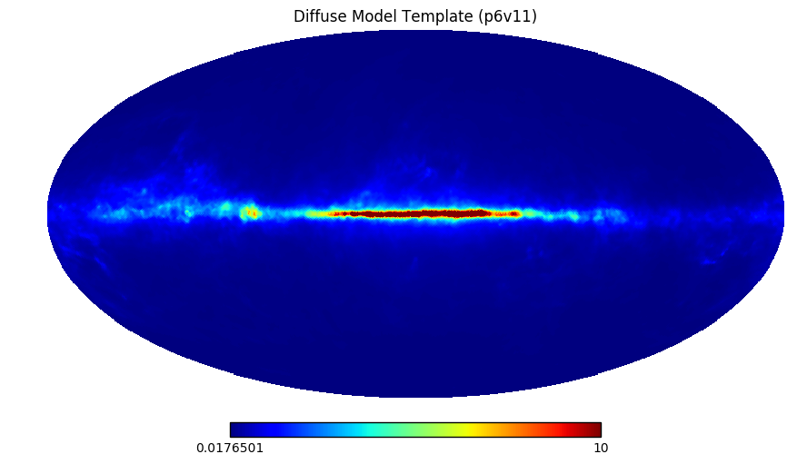

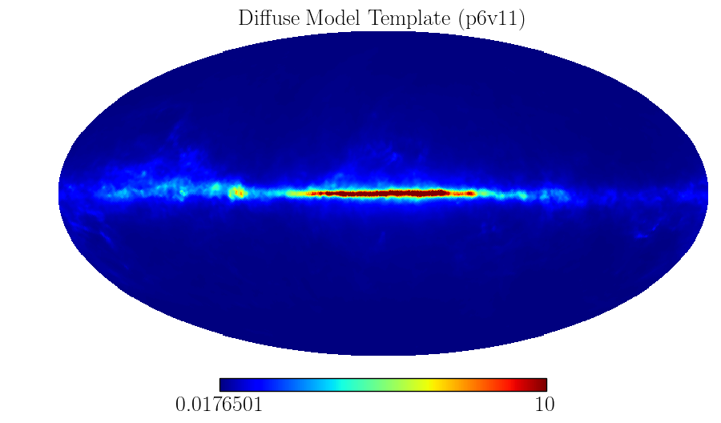

Isotropic Emission
~~~~~~~~~~~~~~~~~~

There is also an approximately isotropic contribution to the data from
extragalactic emission and also cosmic ray contamination. Note that this
map makes the fact the template has been exposure corrected manifest.

.. code:: python

    iso = np.load('fermi_data/template_iso.npy')
    
    hp.mollview(iso,title='Isotropic Emission Template')

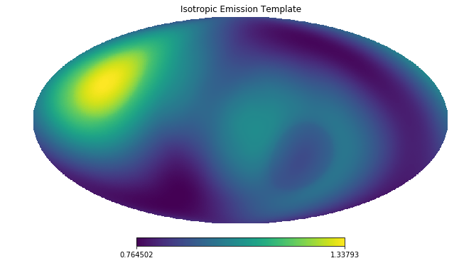

*Fermi* Bubbles
~~~~~~~~~~~~~~~

We also provide a separate model for emission from the *Fermi* bubbles.
Emission from the bubbles is taken to be uniform in intensity, which
becomes non-uniform in counts after exposure correction.

.. code:: python

    bub = np.load('fermi_data/template_bub.npy')
    
    hp.mollview(bub,title='Fermi Bubbles Template')

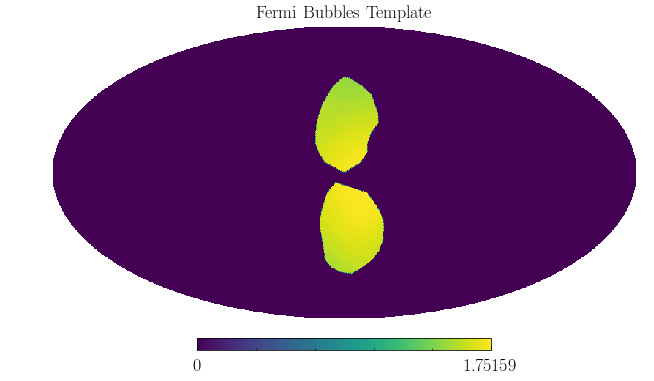

Point Source Catalog Model
~~~~~~~~~~~~~~~~~~~~~~~~~~

As seen in the initial data, the gamma-ray sky includes some extremely
bright point sources. As such even if a mask is used to largely cover
these, it is still often a good idea to model the point sources as well.
Below we show the template for these point sources.

A linear plot of this map shows that these point sources are quite
localised on the sky, but in the log plot below we can clearly see their
spread due to the Fermi PSF.

.. code:: python

    psc = np.load('fermi_data/template_psc.npy')
    
    hp.mollview(psc,title='Point Source Catalog Template',max=50)
    
    hp.mollview(np.log10(psc),title='Point Source Catalog Template - Log')

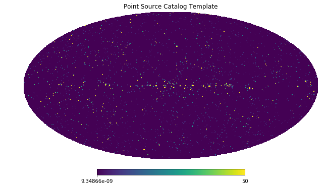

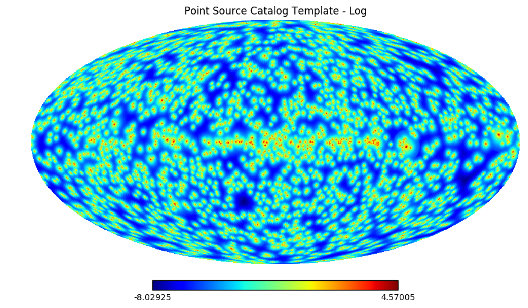

Model for the Galactic Center Excess
~~~~~~~~~~~~~~~~~~~~~~~~~~~~~~~~~~~~

Finally we include a model to describe the Galactic Center Excess (GCE).
Regardless of the origin of this excess, it has been shown to be
spatially distributed as approximately a squared generalized
Navarro–Frenk–White (NFW) profile integrated along the line of sight.
The generalized NFW for the Milky Way has the form:

.. math:: \rho(r) = \rho_0 \frac{(r/r_s)^{-\gamma}}{(1+r/r_s)^{3-\gamma}}\,,

where :math:`r` is the distance from the Galactic center. We take
:math:`r_s = 8.5` kpc, :math:`\gamma = 1.0`, and choose :math:`\rho_0`
such that :math:`\rho(r_s) = 0.4` GeV/cm\ :math:`^3`. The flux GCE
template is then formed as:

.. math:: J(\psi) = \int_{\rm los} \rho^2(r) ds\,,

where :math:`s` parameterizes the line of sight distance, which is
integrated over, and :math:`\psi` is the angle away from the Galactic
center.

.. code:: python

    gce = np.load('fermi_data/template_gce.npy')
    
    hp.mollview(gce,title='Galactic Center Excess Template',max=50)
    
    hp.mollview(np.log10(gce),title='Galactic Center Excess Template - Log')

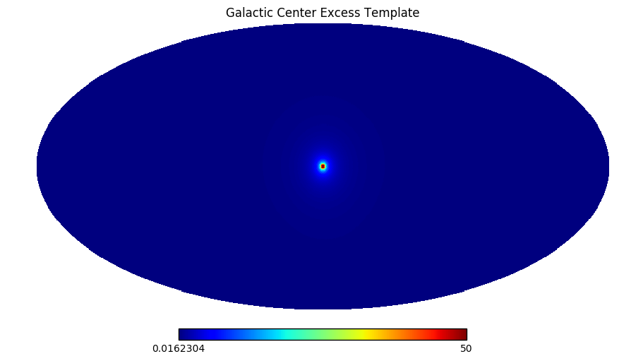

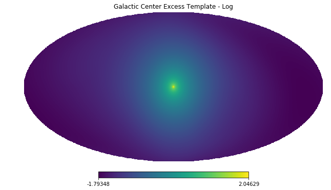

Model for Disk Correlated Point Sources
~~~~~~~~~~~~~~~~~~~~~~~~~~~~~~~~~~~~~~~

When studying the point source origin of the GCE - done in Example 8 -
we will also include a model for point sources correlated with the disk
of the Milky Way. For this purpose we use the following thin disk double
exponential model for the point source population:

.. math:: n(z,R) \propto \exp \left( - R / 5~\textrm{kpc} \right) \exp \left( - |z| /0.3~\textrm{kpc} \right)\,,

where :math:`R` and :math:`z` are cylindrical polar coordinates measured
from the Galactic Center.

.. code:: python

    disk = np.load('fermi_data/template_dsk.npy')
    
    hp.mollview(disk,title='Thin Disk')
    
    hp.mollview(np.log10(disk),title='Thin Disk - Log')

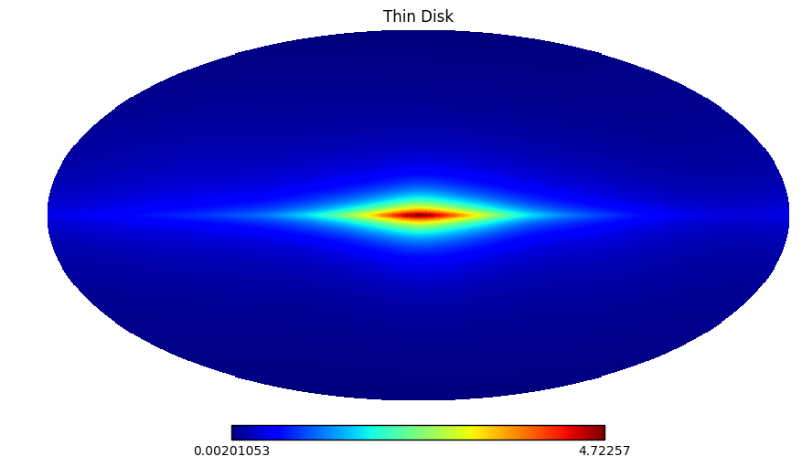

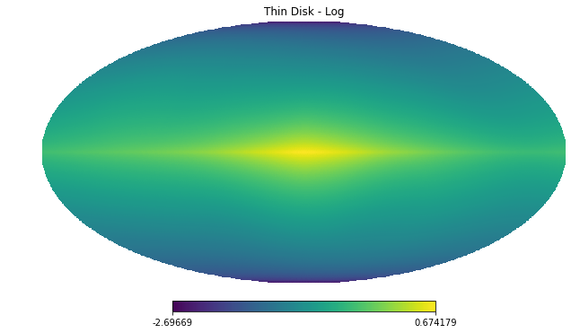

