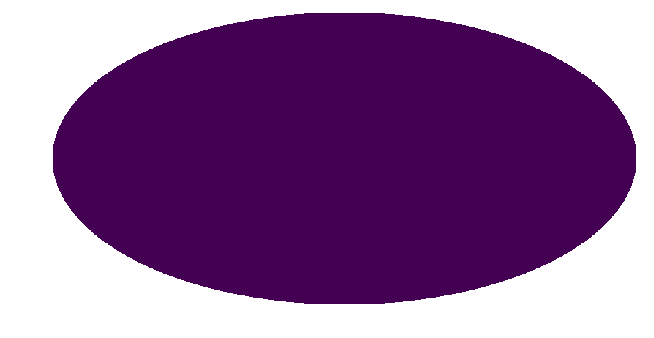
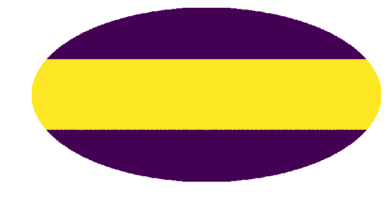
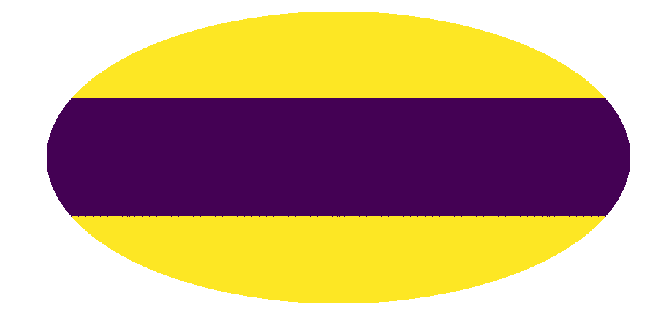
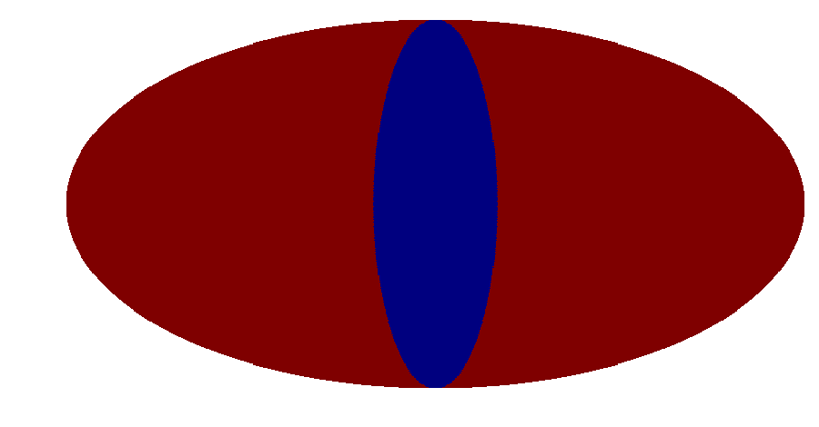
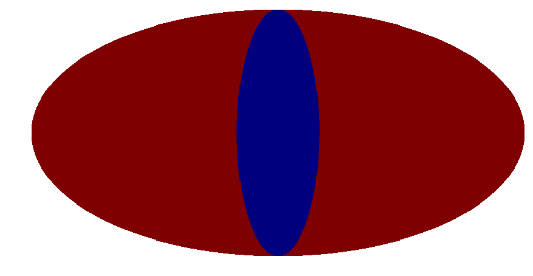
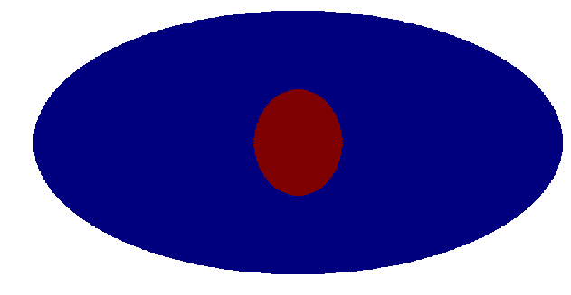
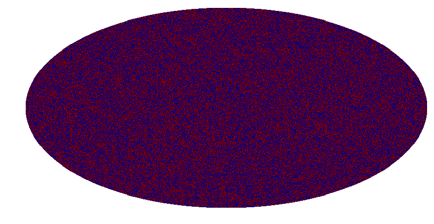
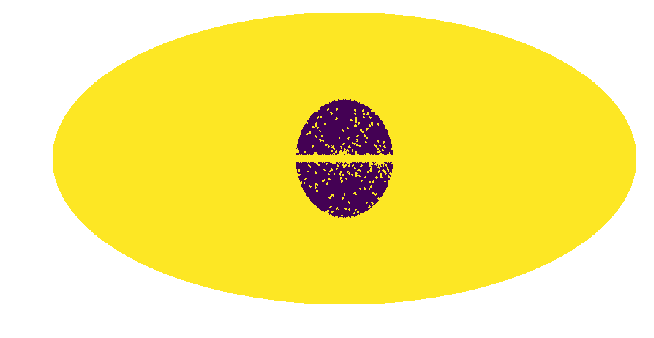

Example 2: Creating Masks
=========================

In this example we show how to create masks using ``create_mask.py``.

Often it is convenient to consider only a reduced Region of Interest
(ROI) when analyzing the data. In order to do this we need to create a
mask. The masks are boolean arrays where pixels labelled as ``True`` are
masked and those labelled ``False`` are unmasked. In this notebook we
give examples of how to create various masks.

The masks are created by ``create_mask.py`` and can be passed to an
instance of ``nptfit`` via the function ``load_mask`` for a run, or an
instance of ``dnds_analysis`` via ``load_mask_analysis`` for an
analysis. If no mask is specified the code defaults to the full sky as
the ROI.

**NB:** Before you can call functions from NPTFit, you must have it
installed. Instructions to do so can be found here:

http://nptfit.readthedocs.io/

.. code:: python

    # Import relevant modules
    
    %matplotlib inline
    %load_ext autoreload
    %autoreload 2
    
    import numpy as np
    import healpy as hp
    
    from NPTFit import create_mask as cm # Module for creating masks

Example 1: Mask Nothing
-----------------------

If no options are specified, create mask returns an empty mask. In the
plot here and for those below, blue represents unmasked, red masked.

.. code:: python

    example1 = cm.make_mask_total()
    hp.mollview(example1, title='', cbar=False, min=0,max=1)

Example 2: Band Mask
--------------------

Here we show an example of how to mask a region either side of the plane
- specifically we mask 30 degrees either side

.. code:: python

    example2 = cm.make_mask_total(band_mask = True, band_mask_range = 30)
    hp.mollview(example2, title='', cbar = False, min=0, max=1)

Example 3: Mask outside a band in *b* and *l*
---------------------------------------------

This example shows several methods of masking outside specified regions
in galactic longitude (*l*) and latitude (*b*). The third example shows
how when two different masks are specified, the mask returned is the
combination of both.

.. code:: python

    example3a = cm.make_mask_total(l_mask = False, l_deg_min = -30, l_deg_max = 30, 
                                   b_mask = True, b_deg_min = -30, b_deg_max = 30)
    hp.mollview(example3a,title='',cbar=False,min=0,max=1)
    
    example3b = cm.make_mask_total(l_mask = True, l_deg_min = -30, l_deg_max = 30, 
                                   b_mask = False, b_deg_min = -30, b_deg_max = 30)
    hp.mollview(example3b,title='',cbar=False,min=0,max=1)
    
    example3c = cm.make_mask_total(l_mask = True, l_deg_min = -30, l_deg_max = 30, 
                                  b_mask = True, b_deg_min = -30, b_deg_max = 30)
    hp.mollview(example3c,title='',cbar=False,min=0,max=1)

Example 4: Ring and Annulus Mask
--------------------------------

Next we show examples of masking outside a ring or annulus. The final
example demonstrates that the ring need not be at the galactic center.

.. code:: python

    example4a = cm.make_mask_total(mask_ring = True, inner = 0, outer = 30, ring_b = 0, ring_l = 0)
    hp.mollview(example4a,title='',cbar=False,min=0,max=1)
    
    example4b = cm.make_mask_total(mask_ring = True, inner = 30, outer = 180, ring_b = 0, ring_l = 0)
    hp.mollview(example4b,title='',cbar=False,min=0,max=1)
    
    example4c = cm.make_mask_total(mask_ring = True, inner = 30, outer = 90, ring_b = 0, ring_l = 0)
    hp.mollview(example4c,title='',cbar=False,min=0,max=1)
    
    example4d = cm.make_mask_total(mask_ring = True, inner = 0, outer = 30, ring_b = 45, ring_l = 45)
    hp.mollview(example4d,title='',cbar=False,min=0,max=1)

.. image:: Example2_Creating_Masks_files/Example2_Creating_Masks_15_0.png

Example 5: Custom Mask
----------------------

In addition to the options above, we can also add in custom masks. In
this example we highlight this by adding a random mask.

.. code:: python

    random_custom_mask = np.random.choice(np.array([True, False]), hp.nside2npix(128))
    example5 = cm.make_mask_total(custom_mask = random_custom_mask)
    hp.mollview(example5,title='',cbar=False,min=0,max=1)

Example 6: Full Analysis Mask including Custom Point Source Catalog Mask
------------------------------------------------------------------------

Finally we show an example of a full analysis mask that we will use for
an analysis of the Galactic Center Excess in Example 3 and 8. Here we
mask the plane with a band mask, mask outside a ring and also include a
custom point source mask. The details of the point source mask are given
in Example 1.

**NB:** before the point source mask can be loaded, the Fermi Data needs
to be downloaded. See details in Example 1.

.. code:: python

    pscmask=np.array(np.load('fermi_data/fermidata_pscmask.npy'), dtype=bool)
    example6 = cm.make_mask_total(band_mask = True, band_mask_range = 2,
                                  mask_ring = True, inner = 0, outer = 30,
                                  custom_mask = pscmask)
    hp.mollview(example6,title='',cbar=False,min=0,max=1)

