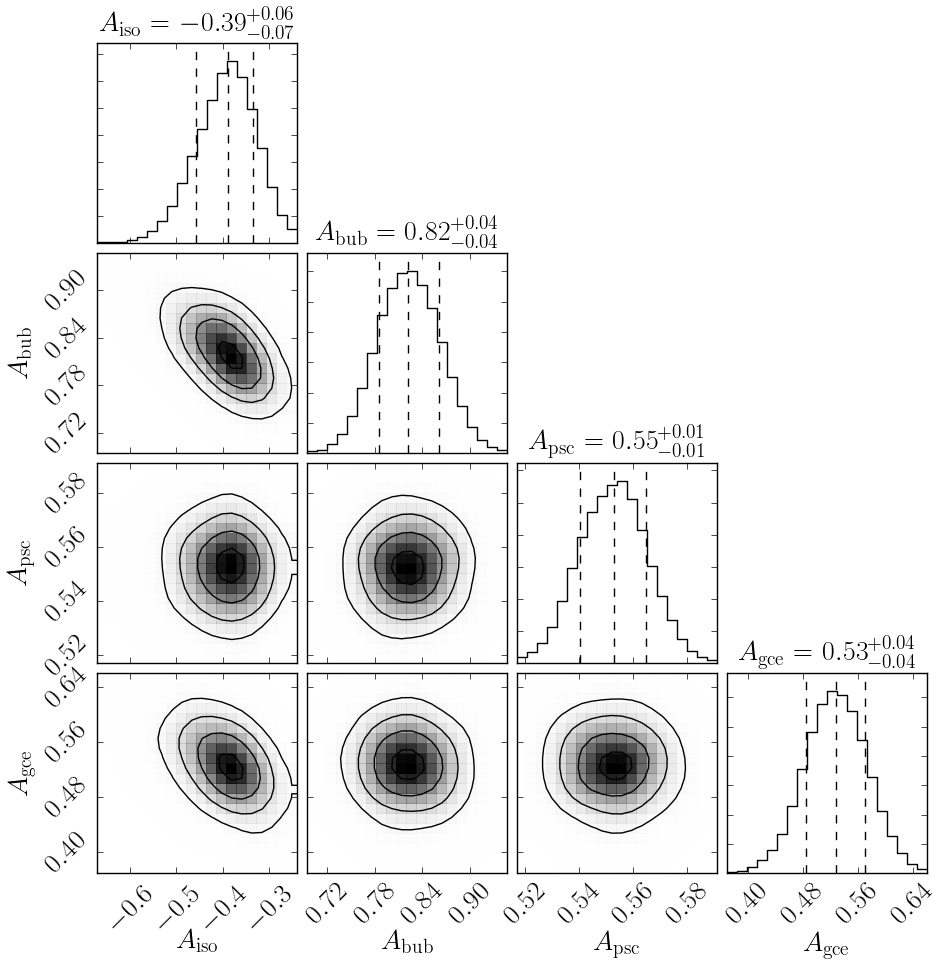
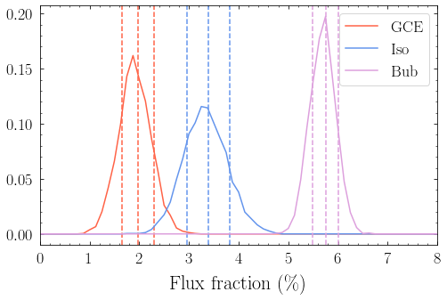

Example 3: Running Poissonian Scans with MultiNest
==================================================

In this example we demonstrate how to run a scan using only templates
that follow Poisson statistics. Nevertheless many aspects of how the
code works in general, such as initialization, loading data, masks and
templates, and running the code with MultiNest carry over to the
non-Poissonian case.

In detail we will perform an analysis of the inner galaxy involving all
five background templates discussed in Example 1. We will show that the
fit prefers a non-zero value for the GCE template.

**NB:** This example makes use of the Fermi Data, which needs to already
be installed. See Example 1 for details.

.. code:: ipython3

    # Import relevant modules
    
    %matplotlib inline
    %load_ext autoreload
    %autoreload 2
    
    import numpy as np
    import corner
    import matplotlib.pyplot as plt
    
    from NPTFit import nptfit # module for performing scan
    from NPTFit import create_mask as cm # module for creating the mask
    from NPTFit import dnds_analysis # module for analysing the output

Step 1: Setting up an instance of NPTFit
----------------------------------------

To begin with we need to create an instance of ``NPTF`` from
``nptfit.py``. We will load it with the ``tag`` set to
“Poissonian_Example”, which is the name attached to the folder within
the chains directory where the output will be stored. Note for long runs
the chains output can become large, so periodically deleting runs you
are no longer using is recommended.

.. code:: ipython3

    n = nptfit.NPTF(tag='Poissonian_Example')

The full list of parameters that can be set with the initialization are
as follows (all are optional).

+-----------------------+-----------------------+-----------------------+
| Argument              | Defaults              | Purpose               |
+=======================+=======================+=======================+
| tag                   | “Untagged”            | The label of the file |
|                       |                       | where the output of   |
|                       |                       | MultiNest will be     |
|                       |                       | stored, specifically  |
|                       |                       | they are stored at    |
|                       |                       | ``work_dir/chains/tag |
|                       |                       | /``.                  |
+-----------------------+-----------------------+-----------------------+
| work_dir              | $pwd                  | The directory where   |
|                       |                       | all outputs from the  |
|                       |                       | NPTF will be stored.  |
|                       |                       | This defaults to the  |
|                       |                       | notebook directory,   |
|                       |                       | but an alternative    |
|                       |                       | can be specified.     |
+-----------------------+-----------------------+-----------------------+
| psf_dir               | work_dir/psf_dir/     | Where the psf         |
|                       |                       | corrections will be   |
|                       |                       | stored (this          |
|                       |                       | correction is         |
|                       |                       | discussed in the next |
|                       |                       | notebook).            |
+-----------------------+-----------------------+-----------------------+

Step 2: Add in Data, a Mask and Background Templates
----------------------------------------------------

Next we need to pass the code some data to analyze. For this purpose we
use the Fermi Data described in Example 1. The format for ``load_data``
is data and then exposure.

**NB:** we emphasize that although we use the example of HEALPix maps
here, the code more generally works on any 1-d arrays, as long as the
data, exposure, mask, and templates all have the same length.

Code to embed data on a regular Cartesian grid into a HEALPix map can be
found here: https://github.com/nickrodd/grid2healpix.

.. code:: ipython3

    fermi_data = np.load('fermi_data/fermidata_counts.npy').astype(np.int32)
    fermi_exposure = np.load('fermi_data/fermidata_exposure.npy')
    n.load_data(fermi_data, fermi_exposure)

In order to study the inner galaxy, we restrict ourselves to a smaller
ROI defined by the analysis mask discussed in Example 2. The mask must
be the same length as the data and exposure.

.. code:: ipython3

    pscmask=np.array(np.load('fermi_data/fermidata_pscmask.npy'), dtype=bool)
    analysis_mask = cm.make_mask_total(band_mask = True, band_mask_range = 2,
                                       mask_ring = True, inner = 0, outer = 30,
                                       custom_mask = pscmask)
    n.load_mask(analysis_mask)

Add in the templates we will want to use as background models. When
adding templates, the first entry is the template itself and the second
the string by which it is identified. The length for each template must
again match the data.

.. code:: ipython3

    dif = np.load('fermi_data/template_dif.npy')
    iso = np.load('fermi_data/template_iso.npy')
    bub = np.load('fermi_data/template_bub.npy')
    psc = np.load('fermi_data/template_psc.npy')
    gce = np.load('fermi_data/template_gce.npy')
    
    n.add_template(dif, 'dif')
    n.add_template(iso, 'iso')
    n.add_template(bub, 'bub')
    n.add_template(psc, 'psc')
    n.add_template(gce, 'gce')

Step 3: Add Background Models to the Fit
----------------------------------------

Now from this list of templates the ``NPTF`` now knows about, we add in
a series of background models which will be passed to MultiNest. In
Example 7 we will show how to evaluate the likelihood without MultiNest,
so that it can be interfaced with alternative inference packages.

Poissonian templates only have one parameter associated with them:
:math:`A` the template normalisation. Poissonian models are added to the
fit via ``add_poiss_model``. The first argument sets the spatial
template for this background model, and should match the string used in
``add_template``. The second argument is a ``LaTeX`` ready string used
to identify the floated parameter later on.

By default added models will be floated. For floated templates the next
two parameters are the prior range, added in the form
``[param_min, param_max]`` and then whether the prior is log flat
(``True``) or linear flat (``False``). For log flat priors the priors
are specified as indices, so that ``[-2,1]`` floats over a linear range
``[0.01,10]``.

Templates can also be added with a fixed normalisation. In this case no
prior need be specified and instead ``fixed=True`` should be specified
as well as ``fixed_norm=value``, where ``value`` is :math:`A` the
template normalisation.

We use each of these possibilities in the example below.

.. code:: ipython3

    n.add_poiss_model('dif', '$A_\mathrm{dif}$', False, fixed=True, fixed_norm=13.20)
    n.add_poiss_model('iso', '$A_\mathrm{iso}$', [-2,1], True)
    n.add_poiss_model('bub', '$A_\mathrm{bub}$', [0,2], False)
    n.add_poiss_model('psc', '$A_\mathrm{psc}$', [0,2], False)
    n.add_poiss_model('gce', '$A_\mathrm{gce}$', [0,2], False)

Note the diffuse model is normalised to a much larger value than the
maximum prior of the other templates. This is because the diffuse model
explains the majority of the flux in our ROI. The value of 13 was
determined from a fit where the diffuse model was not fixed.

Step 4: Configure the Scan
--------------------------

Now the scan knows what models we want to fit to the data, we can
configure the scan. In essence this step prepares all the information
given above into an efficient format for calculating the likelihood. The
main actions performed are: 1. Take the data and templates, and reduce
them to only the ROI we will use as defined by the mask; 2. Further for
a non-Poissonian scan an accounting for the number of exposure regions
requested is made; and 3. Take the priors and parameters and prepare
them into an efficient form for calculating the likelihood function that
can then be used directly or passed to MultiNest.

.. code:: ipython3

    n.configure_for_scan()

.. parsed-literal::

    The number of parameters to be fit is 4

Step 5: Perform the Scan
------------------------

Having setup all the parameters, we can now perform the scan using
MultiNest. We will show an example of how to manually calculate the
likelihood in Example 7.

+-----------------------+-----------------------+-----------------------+
| Argument              | Default Value         | Purpose               |
+=======================+=======================+=======================+
| run_tag               | None                  | An additional tag can |
|                       |                       | be specified to       |
|                       |                       | create a subdirectory |
|                       |                       | of                    |
|                       |                       | work_dir/chains/tag/  |
|                       |                       | in which the output   |
|                       |                       | is stored.            |
+-----------------------+-----------------------+-----------------------+
| nlive                 | 100                   | Number of live points |
|                       |                       | to be used during the |
|                       |                       | MultiNest scan. A     |
|                       |                       | higher value thatn    |
|                       |                       | 100 is recommended    |
|                       |                       | for most runs,        |
|                       |                       | although larger       |
|                       |                       | values correspond to  |
|                       |                       | increased run time.   |
+-----------------------+-----------------------+-----------------------+
| pymultinest_options   | None                  | When set to None our  |
|                       |                       | default choices for   |
|                       |                       | MultiNest will be     |
|                       |                       | used (explained       |
|                       |                       | below). To alter      |
|                       |                       | these options, a      |
|                       |                       | dictionary of         |
|                       |                       | parameters and their  |
|                       |                       | values should be      |
|                       |                       | placed here.          |
+-----------------------+-----------------------+-----------------------+

Our default MultiNest options are defined as follows:

.. code:: python

   pymultinest_options = {'importance_nested_sampling': False,
                          'resume': False, 'verbose': True,
                          'sampling_efficiency': 'model',
                          'init_MPI': False, 'evidence_tolerance': 0.5,
                          'const_efficiency_mode': False}

For variations on these, a dictionary in the same format should be
passed to ``perform_scan``. A detailed explanation of the MultiNest
options can be found here:
https://johannesbuchner.github.io/PyMultiNest/pymultinest_run.html

.. code:: ipython3

    n.perform_scan(nlive=500)

Step 6: Analyze the Output
--------------------------

Here we show a simple example of the output - the triangle plot. The
full list of possible analysis options is explained in more detail in
Example 9.

In order to do this we need to first load the scan using ``load_scan``,
which takes as an optional argument the same ``run_tag`` as used for the
run. Note that ``load_scan`` can be used to load a run performed in a
previous instance of ``NPTF``, as long as the various parameters match.

After the scan is loaded we then create an instance of
``dnds_analysis``, which takes an instance of ``nptfit.NPTF`` as an
argument - which must already have a scan loaded. From here we simply
make a triangle plot.

.. code:: ipython3

    n.load_scan()
    an = dnds_analysis.Analysis(n)
    an.make_triangle()

.. parsed-literal::

      analysing data from /zfs/nrodd/NPTFRemakeExamples/chains/Poissonian_Example/.txt

The triangle plot makes it clear that a non-zero value of the GCE
template is preferred by the fit. Note also that as we gave the
isotropic template a log flat prior, the parameter in the triangle plot
is :math:`\log_{10} A_\mathrm{iso}`.

We also show the relative fraction of the Flux obtained by the GCE as
compared to other templates. Note the majority of the flux is absorbed
by the diffuse model.

.. code:: ipython3

    an.plot_intensity_fraction_poiss('gce', bins=800, color='tomato', label='GCE')
    an.plot_intensity_fraction_poiss('iso', bins=800, color='cornflowerblue', label='Iso')
    an.plot_intensity_fraction_poiss('bub', bins=800, color='plum', label='Bub')
    plt.xlabel('Flux fraction (%)')
    plt.legend(fancybox = True)
    plt.xlim(0,8);

