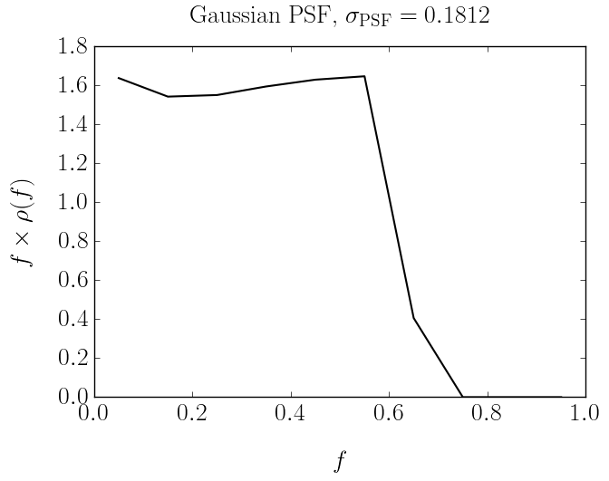
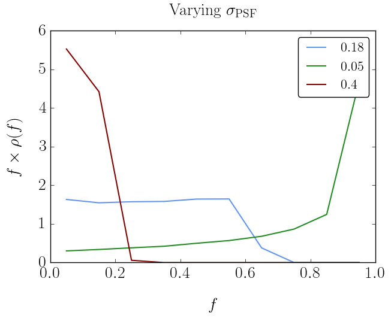
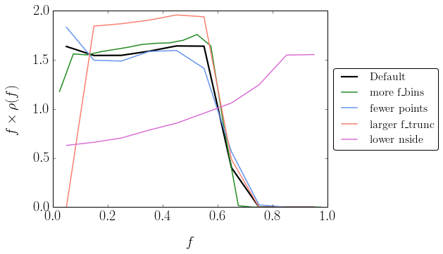
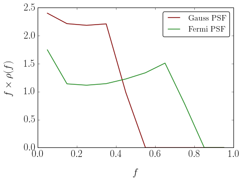
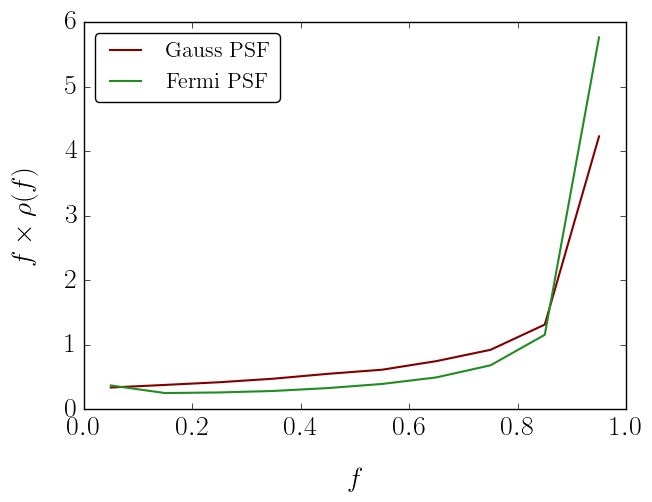

Example 4: NPTF Correction for the Point Spread Function (PSF)
==============================================================

In this example we show how to account for the PSF correction using
``psf_correction.py``

Fundamentally the presence of a non-zero PSF implies that the photons
from any point source will be smeared out into some region around its
true location. This effect must be accounted for in the NPTF. This is
achieved via a function :math:`\rho(f)`. In the code we discretize
:math:`\rho(f)` as an approximation to the full function.

The two outputs of an instance of ``psf_correction`` are: 1. f\_ary, an
array of f values; and 2. df\_rho\_div\_f\_ary, an associated array of
:math:`\Delta f \rho(f)/f` values, where :math:`\Delta f` is the width
of the f\_ary bins.

If the angular reconstruction of the data is perfect, then
:math:`\rho(f) = \delta(f-1)`. In many situations, such as for the
*Fermi* data at higher energies, a Gaussian approximation of the PSF
will suffice. Even then there are a number of variables that go into
evaluating the correction, as shown below. Finally we will show how the
code can be used for the case of non-Gaussian PSFs.

As the calculation of :math:`\rho(f)` can be time consuming, we always
save the output to avoid recomputing the same correction twice.
Consequently it can be convenient to have a common ``psf_dir`` where all
PSF corrections for the runs are stored.

.. code:: python

    # Import relevant modules
    
    %matplotlib inline
    %load_ext autoreload
    %autoreload 2
    
    import numpy as np
    import matplotlib.pyplot as plt
    from matplotlib import rcParams
    
    from NPTFit import psf_correction as pc # Module for determining the PSF correction

.. code:: python

    # Set plotting options
    rcParams['xtick.labelsize'] = 20
    rcParams['ytick.labelsize'] = 20
    rcParams['axes.labelsize'] = 20
    rcParams['axes.titlesize'] = 20
    rcParams['font.family'] = 'serif'
    rcParams['font.serif'] = 'CMU Serif'
    rcParams['figure.figsize'] = (7,5)
    rcParams['legend.fontsize'] = 16
    rcParams['lines.linewidth'] = 1.5
    # rcParams['text.usetex'] = True
    # rcParams['axes.labelpad'] = 20

Example 1: Default Gaussian PSF
-------------------------------

We start by showing the PSF correction for a Gaussian PSF - that is the
PSF as a function of :math:`r` is
:math:`\exp \left[ -r^2 / (2\sigma^2) \right]` - with :math:`\sigma` set
to the value of the 68% containment radius for the PSF of the *Fermi*
dataset we will use in later examples.

.. code:: python

    pc_inst = pc.psf_correction(psf_sigma_deg=0.1812)
    f_ary_1 = pc_inst.f_ary
    df_rho_div_f_ary_1 = pc_inst.df_rho_div_f_ary
    
    print 'f_ary:', f_ary_1
    print 'df_rho_div_f_ary:', df_rho_div_f_ary_1
    
    plt.plot(f_ary_1,f_ary_1**2*df_rho_div_f_ary_1/(f_ary_1[1]-f_ary_1[0]),color='black')
    plt.xlabel('$f$')
    plt.ylabel('$f \\times \\rho(f)$')
    plt.title('Gaussian PSF, $\sigma_\mathrm{PSF} = 0.1812$', y=1.04)

.. parsed-literal::

    File saved as: /group/hepheno/smsharma/NPTFit/examples/psf_dir/gauss_128_0.181_10_50000_1000_0.01.npy
    f_ary: [ 0.05  0.15  0.25  0.35  0.45  0.55  0.65  0.75  0.85  0.95]
    df_rho_div_f_ary: [ 65.46944526   6.86615652   2.47401808   1.29651177   0.81097819
       0.54213866   0.0950746    0.           0.           0.        ]

.. parsed-literal::

    <matplotlib.text.Text at 0x2b99f2400ed0>

Example 2: Impact of changing :math:`\sigma`
--------------------------------------------

Here we show the impact on the PSF of changing :math:`\sigma`. From the
plot we can see that for a small PSF, :math:`\rho(f)` approaches the no
PSF case of :math:`\delta(f-1)` implying that the flux fractions are
concentrated at a single large value. As :math:`\sigma` increases we
move away from this idealized scenario and the flux becomes more spread
out, leading to a :math:`\rho(f)` peaked at lower flux values.

.. code:: python

    pc_inst = pc.psf_correction(psf_sigma_deg=0.05)
    f_ary_2 = pc_inst.f_ary
    df_rho_div_f_ary_2 = pc_inst.df_rho_div_f_ary
    
    pc_inst = pc.psf_correction(psf_sigma_deg=0.4)
    f_ary_3 = pc_inst.f_ary
    df_rho_div_f_ary_3 = pc_inst.df_rho_div_f_ary
    
    plt.plot(f_ary_1,f_ary_1**2*df_rho_div_f_ary_1/(f_ary_1[1]-f_ary_1[0]),color='cornflowerblue',label='0.18')
    plt.plot(f_ary_2,f_ary_2**2*df_rho_div_f_ary_2/(f_ary_2[1]-f_ary_2[0]),color='forestgreen',label='0.05')
    plt.plot(f_ary_3,f_ary_3**2*df_rho_div_f_ary_3/(f_ary_3[1]-f_ary_3[0]),color='maroon',label='0.4')
    plt.xlabel('$f$')
    plt.ylabel('$f \\times \\rho(f)$')
    plt.legend(loc='upper right', fancybox=True)
    plt.title('Varying $\sigma_\mathrm{PSF}$', y=1.04)

.. parsed-literal::

    File saved as: /group/hepheno/smsharma/NPTFit/examples/psf_dir/gauss_128_0.05_10_50000_1000_0.01.npy
    File saved as: /group/hepheno/smsharma/NPTFit/examples/psf_dir/gauss_128_0.4_10_50000_1000_0.01.npy

.. parsed-literal::

    <matplotlib.text.Text at 0x2b99f252b510>

Example 3: Changing the default options for determining :math:`\rho(f)`
-----------------------------------------------------------------------

In this example we show how for a given PSF, the other parameters
associated with how accurately we calculate :math:`\rho(f)` can impact
what we get back. The parameters that can be changed are are:

+---------------------+------------+--------------------------------------------------------+
| Argument            | Defaults   | Purpose                                                |
+=====================+============+========================================================+
| ``num_f_bins``      | 10         | number of f\_bins used                                 |
+---------------------+------------+--------------------------------------------------------+
| ``n_psf``           | 50000      | number of PSFs placed down when calculating            |
+---------------------+------------+--------------------------------------------------------+
| ``n_pts_per_psf``   | 1000       | number of points to place per psf in the calculation   |
+---------------------+------------+--------------------------------------------------------+
| ``f_trunc``         | 0.01       | minimum flux fraction to keep track of                 |
+---------------------+------------+--------------------------------------------------------+
| ``nside``           | 128        | nside of the map the PSF is used on                    |
+---------------------+------------+--------------------------------------------------------+

The default parameters have been chosen to be accurate enough for the
Fermi analyses we will be performed later. But if the user changes the
PSF (even just :math:`\sigma`), it is important to be sure that the
above parameters are chosen so that :math:`\rho(f)` is evaluated
accurately enough.

In general increasing ``num_f_bins``, ``n_psf``, and ``n_pts_per_psf``,
whilst decreasing ``f_trunc`` leads to a more accurate :math:`\rho(f)`.
But each will also slow down the evaluation of :math:`\rho(f)`, and in
the case of ``num_f_bin``, slow down the subsequent non-Poissonian
likelihood evaluation.

``nside`` should be set to the value of the map being analysed, but we
also highlight the impact of changing it below. For an analysis on a
non-HEALPix grid, the PSF can often be approximated by an appropriate
HEALPix binning. If this is not the case, however, a different approach
must be pursued in calculating :math:`\rho(f)`.

.. code:: python

    pc_inst = pc.psf_correction(psf_sigma_deg=0.1812,num_f_bins=20)
    f_ary_4 = pc_inst.f_ary
    df_rho_div_f_ary_4 = pc_inst.df_rho_div_f_ary
    
    pc_inst = pc.psf_correction(psf_sigma_deg=0.1812,n_psf=5000,n_pts_per_psf=100)
    f_ary_5 = pc_inst.f_ary
    df_rho_div_f_ary_5 = pc_inst.df_rho_div_f_ary
    
    pc_inst = pc.psf_correction(psf_sigma_deg=0.1812,f_trunc=0.1)
    f_ary_6 = pc_inst.f_ary
    df_rho_div_f_ary_6 = pc_inst.df_rho_div_f_ary
    
    pc_inst = pc.psf_correction(psf_sigma_deg=0.1812,nside=64)
    f_ary_7 = pc_inst.f_ary
    df_rho_div_f_ary_7 = pc_inst.df_rho_div_f_ary
    
    plt.plot(f_ary_1,f_ary_1**2*df_rho_div_f_ary_1/(f_ary_1[1]-f_ary_1[0]),color='black',label=r'Default', lw=2.2)
    plt.plot(f_ary_4,f_ary_4**2*df_rho_div_f_ary_4/(f_ary_4[1]-f_ary_4[0]),color='forestgreen',label=r'more f\_bins')
    plt.plot(f_ary_5,f_ary_5**2*df_rho_div_f_ary_5/(f_ary_5[1]-f_ary_5[0]),color='cornflowerblue',label=r'fewer points')
    plt.plot(f_ary_6,f_ary_6**2*df_rho_div_f_ary_6/(f_ary_6[1]-f_ary_6[0]),color='salmon',label=r'larger f\_trunc')
    plt.plot(f_ary_7,f_ary_7**2*df_rho_div_f_ary_7/(f_ary_7[1]-f_ary_7[0]),color='orchid',label=r'lower nside')
    plt.xlabel('$f$')
    plt.ylabel('$f \\times \\rho(f)$')
    plt.legend(loc='center left', bbox_to_anchor=(1, 0.5), fancybox=True)

.. parsed-literal::

    File saved as: /group/hepheno/smsharma/NPTFit/examples/psf_dir/gauss_128_0.181_20_50000_1000_0.01.npy
    File saved as: /group/hepheno/smsharma/NPTFit/examples/psf_dir/gauss_128_0.181_10_5000_100_0.01.npy
    File saved as: /group/hepheno/smsharma/NPTFit/examples/psf_dir/gauss_128_0.181_10_50000_1000_0.1.npy
    File saved as: /group/hepheno/smsharma/NPTFit/examples/psf_dir/gauss_64_0.181_10_50000_1000_0.01.npy

.. parsed-literal::

    <matplotlib.legend.Legend at 0x2b99f2632e90>

Example 4: Custom PSF
---------------------

In addition to the default Gausian PSF, ``psf_correction.py`` also has
the option of taking in a custom PSF. In order to use this ability, the
user needs to initialise ``psf_correction`` with ``delay_compute=True``,
manually define the parameters that define the PSF and then call
``make_or_load_psf_corr``.

The variables that need to be redefined in the instance of
``psf_correction`` are:

+----------------+----------------+
| Argument       | Purpose        |
+================+================+
| ``psf_r_func`` | the psf as a   |
|                | function of r, |
|                | distance in    |
|                | radians from   |
|                | the center of  |
|                | the point      |
|                | source         |
+----------------+----------------+
| ``sample_psf_m | maximum        |
| ax``           | distance to    |
|                | sample the psf |
|                | from the       |
|                | center, should |
|                | be larger for  |
|                | psfs with long |
|                | tails          |
+----------------+----------------+
| ``psf_samples` | number of      |
| `              | samples to     |
|                | make from the  |
|                | psf (linearly  |
|                | spaced) from 0 |
|                | to             |
|                | sample\_psf\_m |
|                | ax,            |
|                | should be      |
|                | large enough   |
|                | to adequately  |
|                | represent the  |
|                | full psf       |
+----------------+----------------+
| ``psf_tag``    | label the psf  |
|                | is saved with  |
+----------------+----------------+

As an example of a more complicated PSF we consider the full Fermi-LAT
PSF. The PSF of Fermi is approximately Gaussian near the core, but has
larger tails. To model this a pair of King functions are used to
describe the radial distribution. Below we show a comparison between the
Gaussian approximation and the full PSF, for two different energies. As
shown, for low energies where the Fermi PSF is larger, the difference
between the two can be significant. For higher energies where the PSF
becomes smaller, however, the difference is marginal.

For the full details of the Fermi-LAT PSF, see:
http://fermi.gsfc.nasa.gov/ssc/data/analysis/documentation/Cicerone/Cicerone\_LAT\_IRFs/IRF\_PSF.html

.. code:: python

    # Fermi-LAT PSF at 2 GeV
    
    # Calculate the appropriate Gaussian approximation to the PSF for 2 GeV
    pc_inst = pc.psf_correction(psf_sigma_deg=0.2354)
    f_ary_8 = pc_inst.f_ary
    df_rho_div_f_ary_8 = pc_inst.df_rho_div_f_ary
    
    # Define parameters that specify the Fermi-LAT PSF at 2 GeV
    fcore = 0.748988248179
    score = 0.428653790656
    gcore = 7.82363229341
    stail = 0.715962650769
    gtail = 3.61883748683
    spe = 0.00456544262478
    
    # Define the full PSF in terms of two King functions
    def king_fn(x, sigma, gamma):
        return 1./(2.*np.pi*sigma**2.)*(1.-1./gamma)*(1.+(x**2./(2.*gamma*sigma**2.)))**(-gamma)
    
    def Fermi_PSF(r):
        return fcore*king_fn(r/spe,score,gcore) + (1-fcore)*king_fn(r/spe,stail,gtail)
    
    # Modify the relevant parameters in pc_inst and then make or load the PSF
    pc_inst = pc.psf_correction(delay_compute=True)
    pc_inst.psf_r_func = lambda r: Fermi_PSF(r)
    pc_inst.sample_psf_max = 10.*spe*(score+stail)/2.
    pc_inst.psf_samples = 10000
    pc_inst.psf_tag = 'Fermi_PSF_2GeV'
    pc_inst.make_or_load_psf_corr()
    
    # Extract f_ary and df_rho_div_f_ary as usual
    f_ary_9 = pc_inst.f_ary
    df_rho_div_f_ary_9 = pc_inst.df_rho_div_f_ary
    
    plt.plot(f_ary_8,f_ary_8**2*df_rho_div_f_ary_8/(f_ary_8[1]-f_ary_8[0]),color='maroon',label='Gauss PSF')
    plt.plot(f_ary_8,f_ary_9**2*df_rho_div_f_ary_9/(f_ary_9[1]-f_ary_9[0]),color='forestgreen',label='Fermi PSF')
    plt.xlabel('$f$')
    plt.ylabel('$f \\times \\rho(f)$')
    plt.legend(loc='upper right', fancybox=True)

.. parsed-literal::

    File saved as: /group/hepheno/smsharma/NPTFit/examples/psf_dir/gauss_128_0.235_10_50000_1000_0.01.npy
    File saved as: /group/hepheno/smsharma/NPTFit/examples/psf_dir/Fermi_PSF_2GeV.npy

.. parsed-literal::

    <matplotlib.legend.Legend at 0x2b99f2725d10>

.. code:: python

    # Fermi-LAT PSF at 20 GeV
    
    # Calculate the appropriate Gaussian approximation to the PSF for 20 GeV
    pc_inst = pc.psf_correction(psf_sigma_deg=0.05529)
    f_ary_10 = pc_inst.f_ary
    df_rho_div_f_ary_10 = pc_inst.df_rho_div_f_ary
    
    # Define parameters that specify the Fermi-LAT PSF at 20 GeV
    fcore = 0.834725201378
    score = 0.498192326976
    gcore = 6.32075520959
    stail = 1.06648424558
    gtail = 4.49677834267
    spe = 0.000943339426754
    
    # Define the full PSF in terms of two King functions
    def king_fn(x, sigma, gamma):
        return 1./(2.*np.pi*sigma**2.)*(1.-1./gamma)*(1.+(x**2./(2.*gamma*sigma**2.)))**(-gamma)
    
    def Fermi_PSF(r):
        return fcore*king_fn(r/spe,score,gcore) + (1-fcore)*king_fn(r/spe,stail,gtail)
    
    # Modify the relevant parameters in pc_inst and then make or load the PSF
    pc_inst = pc.psf_correction(delay_compute=True)
    pc_inst.psf_r_func = lambda r: Fermi_PSF(r)
    pc_inst.sample_psf_max = 10.*spe*(score+stail)/2.
    pc_inst.psf_samples = 10000
    pc_inst.psf_tag = 'Fermi_PSF_20GeV'
    pc_inst.make_or_load_psf_corr()
    
    # Extract f_ary and df_rho_div_f_ary as usual
    f_ary_11 = pc_inst.f_ary
    df_rho_div_f_ary_11 = pc_inst.df_rho_div_f_ary
    
    plt.plot(f_ary_10,f_ary_10**2*df_rho_div_f_ary_10/(f_ary_10[1]-f_ary_10[0]),color='maroon',label='Gauss PSF')
    plt.plot(f_ary_11,f_ary_11**2*df_rho_div_f_ary_11/(f_ary_11[1]-f_ary_11[0]),color='forestgreen',label='Fermi PSF')
    plt.xlabel('$f$')
    plt.ylabel('$f \\times \\rho(f)$')
    plt.legend(loc='upper left', fancybox=True)

.. parsed-literal::

    File saved as: /group/hepheno/smsharma/NPTFit/examples/psf_dir/gauss_128_0.055_10_50000_1000_0.01.npy
    File saved as: /group/hepheno/smsharma/NPTFit/examples/psf_dir/Fermi_PSF_20GeV.npy

.. parsed-literal::

    <matplotlib.legend.Legend at 0x2b99f27f6250>

The above example also serves as a tutorial on how to combine various
PSFs into a single PSF. In the case of the Fermi PSF the full radial
dependence is the sum of two King functions. More generally if the full
PSF is a combination of multiple individual ones (for example from
multiple energy bins), then this can be formed by just adding these
functions with an appropriate weighting to get a single ``psf_r_func``.
