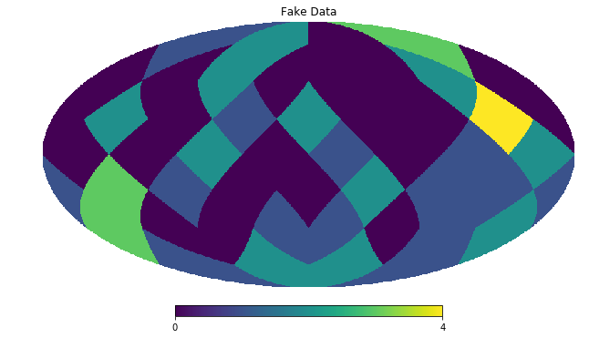
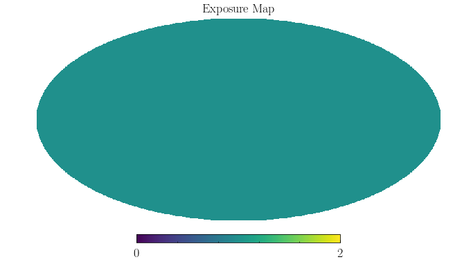
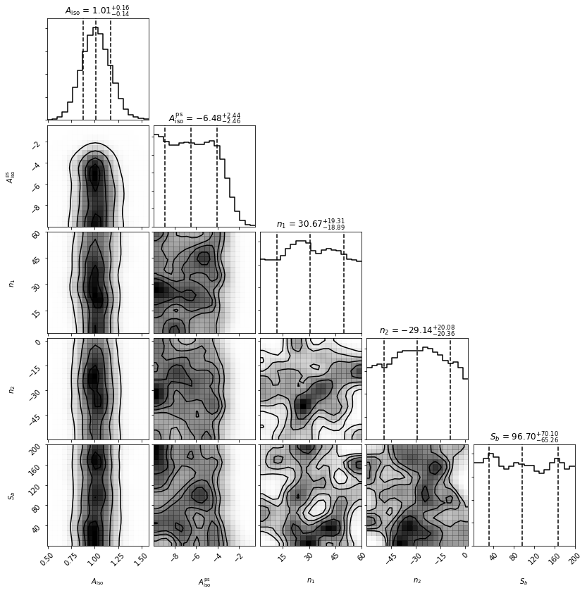
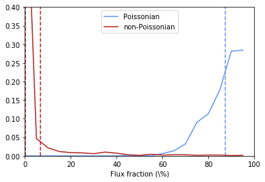
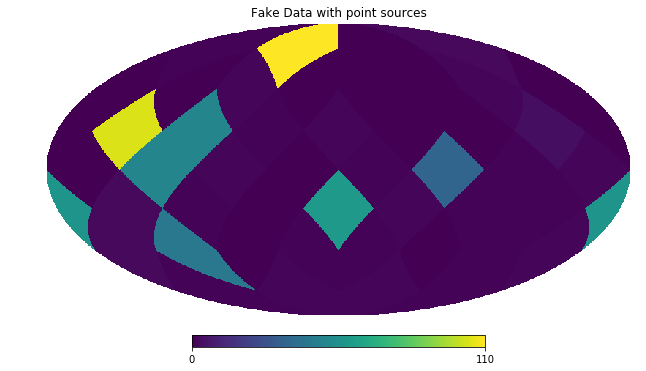
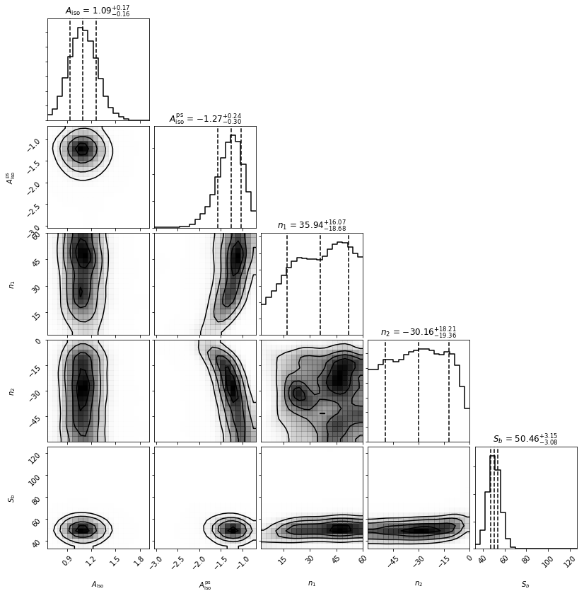
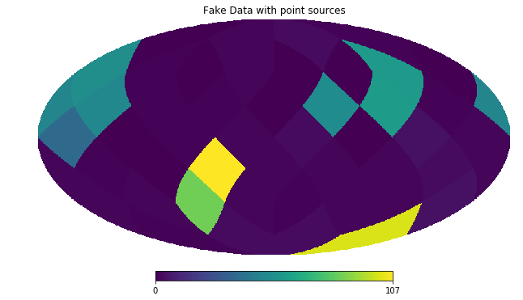
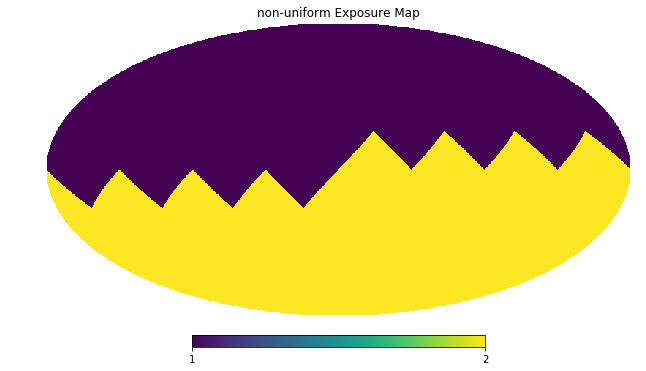
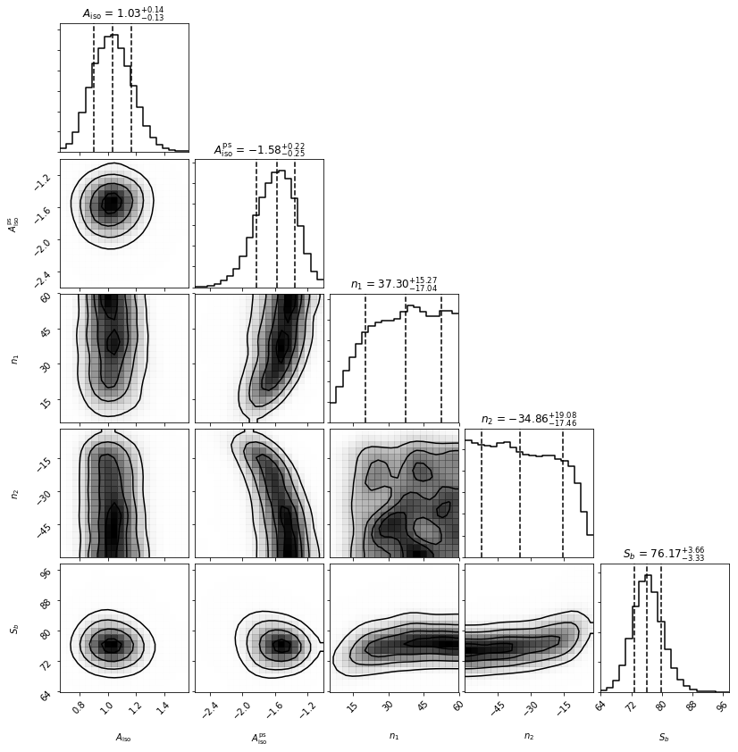
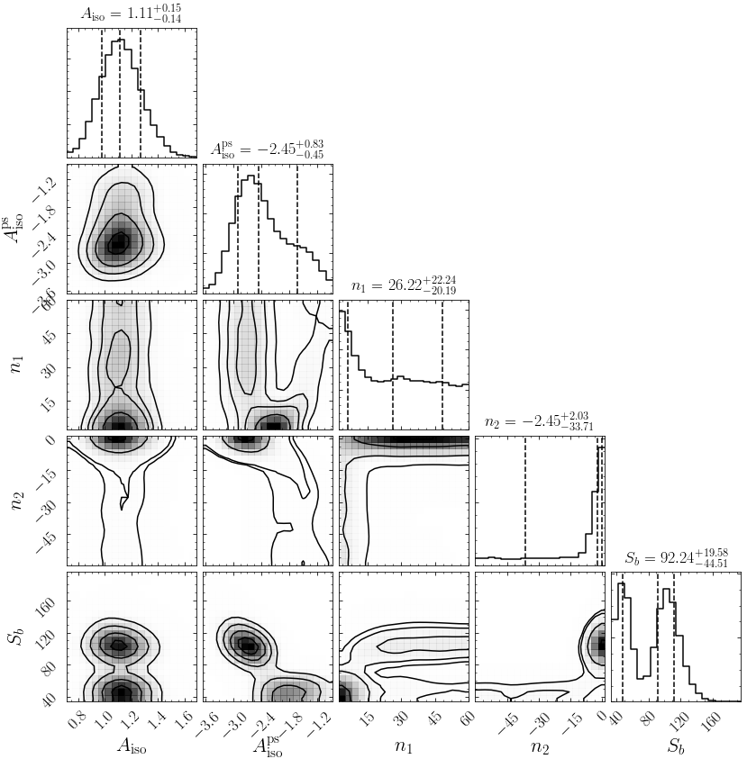

Example 4: Simple NPTF example
==============================

In this example we perform a non-Poissonian template fit in a simplified
setting. Specifically we will restrict ourselves to randomly generated
nside=2 maps, which means our data consists only of 48 pixels.
Nevertheless in this simple setting we will be able to clearly see the
difference between Poissonian and non-Poissonian statistics as well as
basic features of how non-Poissonian template fitting is performed with
the code.

Throughout this example we will assume there is no smearing of the
counts coming from all point sources. The effect of a finite point
spread function on the statistics and how to account for it is discussed
in Example 5.

.. code:: python

    # Import relevant modules
    
    %matplotlib inline
    %load_ext autoreload
    %autoreload 2
    
    import numpy as np
    import healpy as hp
    import matplotlib.pyplot as plt
    from matplotlib import rcParams
    
    from NPTFit import nptfit # module for performing scan
    from NPTFit import dnds_analysis # module for analysing the output
    
    from __future__ import print_function

Example 1: A map without point sources
--------------------------------------

We start out by analyzing a map without any point sources, using a
uniform exposure map. First let's create and plot our random data.

.. code:: python

    nside = 2
    npix = hp.nside2npix(nside)
    data = np.random.poisson(1,npix)
    exposure = np.ones(npix)
    
    hp.mollview(data,title='Fake Data')
    hp.mollview(exposure,title='Exposure Map')

Next we set up an instance of NPTFit and add in the data. We'll analyze
the entire sky at once, so we won't add in a mask.

.. code:: python

    n = nptfit.NPTF(tag='SimpleNPTF_Example')
    n.load_data(data, exposure)

Now we add in templates, one to describe isotropic Poissonian emission
and one for isotropic point sources. Note the different syntax requires
for each.

.. code:: python

    iso = np.ones(npix)
    n.add_template(iso, 'iso_p', units='flux')
    n.add_template(iso, 'iso_np', units='PS')

We add in both models, being careful to select the right template. Here
we model the PS point spread function as a singly broken power law,
which requires four parameters to describe it: the normalization A, the
indices above and below the breaks n1 and n2, and the location of the
break Sb.

More details on the forms for the non-Poissonian model can be found in
Example 6.

.. code:: python

    n.add_poiss_model('iso_p', '$A_\mathrm{iso}$', [0,2], False)
    n.add_non_poiss_model('iso_np',
                          ['$A^\mathrm{ps}_\mathrm{iso}$','$n_1$','$n_2$','$S_b$'],
                          [[-10,1],[2.05,60],[-60,1.95],[0.01,200]],
                          [True,False,False,False])

Once everything is setup, we configure and perform the scan, and then
show the triangle plot and flux fraction plot.

.. code:: python

    n.configure_for_scan()
    n.perform_scan(nlive=500)
    
    n.load_scan()
    an = dnds_analysis.Analysis(n)
    an.make_triangle()
    plt.show()
    plt.close()
    
    an.plot_intensity_fraction_poiss('iso_p', bins=20, color='cornflowerblue', label='Poissonian')
    an.plot_intensity_fraction_non_poiss('iso_np', bins=20, color='firebrick', label='non-Poissonian')
    plt.xlabel('Flux fraction (\%)')
    plt.legend(fancybox = True)
    plt.xlim(0,100);
    plt.ylim(0,0.4);

.. parsed-literal::

    No mask set; defaulting to a blank mask
    The number of parameters to be fit is 5
      analysing data from /group/hepheno/smsharma/NPTFit/examples/chains/SimpleNPTF_Example/.txt

We see that the Poissonian template has absorbed essentially everything,
whilst the non-Poissonian parameters are poorly converged - expected as
there were no point sources injected.

Example 2: A map with point sources
-----------------------------------

We now repeat the analysis above, but now add in 10 mean 50 count point
sources. First lets take the data from above and add the point sources.

.. code:: python

    for ips in range(10):
        data[np.random.randint(npix)] += np.random.poisson(50)
    
    hp.mollview(data,title='Fake Data with point sources')

Now we repeat all the steps used in the example without point sources.

.. code:: python

    n = nptfit.NPTF(tag='SimpleNPTF_Example')
    n.load_data(data,exposure)
    
    iso = np.ones(npix)
    n.add_template(iso, 'iso_p',units='flux')
    n.add_template(iso, 'iso_np',units='PS')
    
    n.add_poiss_model('iso_p', '$A_\mathrm{iso}$', [0,2], False)
    n.add_non_poiss_model('iso_np',
                          ['$A^\mathrm{ps}_\mathrm{iso}$','$n_1$','$n_2$','$S_b$'],
                          [[-10,1],[2.05,60],[-60,1.95],[0.01,200]],
                          [True,False,False,False])
    
    n.configure_for_scan()
    n.perform_scan(nlive=500)
    
    n.load_scan()
    an = dnds_analysis.Analysis(n)
    an.make_triangle()
    plt.show()
    plt.close()

.. parsed-literal::

    No mask set; defaulting to a blank mask
    The number of parameters to be fit is 5
      analysing data from /group/hepheno/smsharma/NPTFit/examples/chains/SimpleNPTF_Example/.txt

We now see that both the Poissonian and non-Poissonian parameters are
quite well converged. Note that the indices both want to have a large
magnitude, which makes sense as we have effectively injected a delta
function in flux, and the singly broken power law is trying to mimic
that. Note that Sb is well converged near 50 counts per source, which is
what we injected.

Example 3: A map with point sources and non-uniform exposure map
----------------------------------------------------------------

We will now repeat the above exercise but on a map without uniform
exposure. This will highlight the importance of exposure regions.

To begin with let's again create the data, but now we pretend that one
side of the sky is expected to obtain twice as many counts as the other
(which could occur if the instrument looked at that half of the sky
twice as long for example).

.. code:: python

    nside = 2
    npix = hp.nside2npix(nside)
    exposure = np.zeros(npix)
    exposure[0:int(npix/2)] = 1.0
    exposure[int(npix/2):npix] = 2.0
    data = np.random.poisson(exposure)
    
    for ips in range(10):
        loc = np.random.randint(npix)
        data[loc] += np.random.poisson(50*exposure[loc])
    
    hp.mollview(data,title='Fake Data with point sources')
    hp.mollview(exposure,title='non-uniform Exposure Map')

Now we again analyze this data. Critically, note that when we configure
the scan we set nexp=2 to indicate that the code should run with 2
exposure regions. In this simple example we know that 2 is all we need,
but in real situations it is worth trying various values of nexp to see
where results converge.

.. code:: python

    n = nptfit.NPTF(tag='SimpleNPTF_Example')
    n.load_data(data,exposure)
    
    iso = np.ones(npix)
    n.add_template(iso, 'iso_p',units='flux')
    n.add_template(iso, 'iso_np',units='PS')
    
    n.add_poiss_model('iso_p', '$A_\mathrm{iso}$', [0,2], False)
    n.add_non_poiss_model('iso_np',
                          ['$A^\mathrm{ps}_\mathrm{iso}$','$n_1$','$n_2$','$S_b$'],
                          [[-10,1],[2.05,60],[-60,1.95],[0.01,200]],
                          [True,False,False,False])
    
    n.configure_for_scan(nexp=2)
    n.perform_scan(nlive=500)
    
    n.load_scan()
    an = dnds_analysis.Analysis(n)
    an.make_triangle()
    plt.show()
    plt.close()

.. parsed-literal::

    No mask set; defaulting to a blank mask
    The number of parameters to be fit is 5
      analysing data from /group/hepheno/smsharma/NPTFit/examples/chains/SimpleNPTF_Example/.txt

Everything is again well converged. Note that this time Sb has converged
near 75, not 50. This is exactly what should be expected though, as the
mean number of injected counts per PS over the sky is 50 x
mean(exposure) = 75.

To highlight the importance of the exposure regions, let's repeat this
using only one exposure region which we emphasize is the **wrong** thing
to do.

.. code:: python

    n = nptfit.NPTF(tag='SimpleNPTF_Example')
    n.load_data(data,exposure)
    
    iso = np.ones(npix)
    n.add_template(iso, 'iso_p',units='flux')
    n.add_template(iso, 'iso_np',units='PS')
    
    n.add_poiss_model('iso_p', '$A_\mathrm{iso}$', [0,2], False)
    n.add_non_poiss_model('iso_np',
                          ['$A^\mathrm{ps}_\mathrm{iso}$','$n_1$','$n_2$','$S_b$'],
                          [[-10,1],[2.05,60],[-60,1.95],[0.01,200]],
                          [True,False,False,False])
    
    n.configure_for_scan(nexp=1)
    n.perform_scan(nlive=500)
    
    n.load_scan()
    an = dnds_analysis.Analysis(n)
    an.make_triangle()
    plt.show()
    plt.close()

.. parsed-literal::

    No mask set; defaulting to a blank mask
    The number of parameters to be fit is 5
      analysing data from /group/hepheno/smsharma/NPTFit/examples/chains/SimpleNPTF_Example/.txt

We see that the non-Poissonian parameters are not as well converged, and
in particular Sb has not converged to its mean value over the sky. Note
that Sb appears in some instance to be bimodal, at 50 and 100
representing the two point source brightnesses if the exposure
correction is not accounted for.
