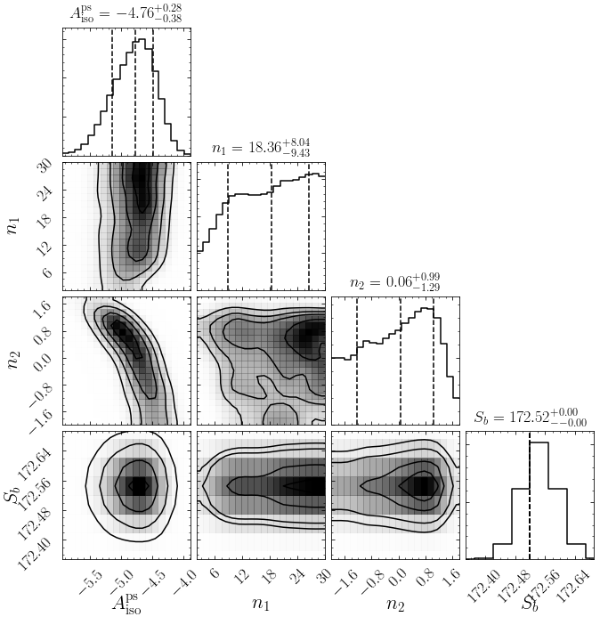
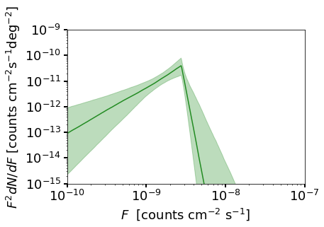

Example 6: Running non-Poissonian Scans with MultiNest
======================================================

In this example we show a simple example of how to run a scan using
templates that follow non-Poisson statistics.

To this end we perform a simple analysis of a small region around the
north galactic pole, looking for isotropically distributed point
sources.

**NB:** This example makes use of the Fermi Data, which needs to already
be installed. See Example 1 for details.

.. code:: python

    # Import relevant modules
    
    %matplotlib inline
    %load_ext autoreload
    %autoreload 2
    
    import numpy as np
    import corner
    import matplotlib.pyplot as plt
    from matplotlib import rcParams
    
    from NPTFit import nptfit # module for performing scan
    from NPTFit import create_mask as cm # module for creating the mask
    from NPTFit import psf_correction as pc # module for determining the PSF correction
    from NPTFit import dnds_analysis # module for analysing the output

Step 1: Setup an instance of NPTFit, add data, mask and templates
-----------------------------------------------------------------

As in the Poissonian case (see Example 3), the first step is to create
an instance of ``nptfit.NPTF`` and add to it data, a mask and templates.
Here we choose an ROI that is a small ring around the galactic north
pole. In this small region we will only use isotropically distributed
templates.

.. code:: python

    n = nptfit.NPTF(tag='non-Poissonian_Example')

.. code:: python

    fermi_data = np.load('fermi_data/fermidata_counts.npy').astype(np.int32)
    fermi_exposure = np.load('fermi_data/fermidata_exposure.npy')
    n.load_data(fermi_data, fermi_exposure)

.. code:: python

    analysis_mask = cm.make_mask_total(mask_ring = True, inner = 0, outer = 5, ring_b = 90, ring_l = 0)
    n.load_mask(analysis_mask)

Now we add the required templates. The ``iso_p`` template here is in
units of photon counts and is exposure corrected, which we anticipate
using as such for the Poissonian model, while for the non-Poissonian
model the underlying PS distribution is truly isotropic.

.. code:: python

    iso_p = np.load('fermi_data/template_iso.npy')
    n.add_template(iso_p, 'iso_p')
    iso_np = np.ones(len(iso_p))
    n.add_template(iso_np, 'iso_np',units='PS')

Step 2: Add Background Models to the Fit
----------------------------------------

We now add background models. For the details of adding a Poissonian
model, see Example 3.

For the non-poissonian model the format is similar, except for the fact
we must account for the additional parameters that describe an
non-Poissonian (NP) template. In ``nptfit``, NP templates are determined
by source count functions which we allow to be specified by a broken
power law with an arbitrary number of breaks.

The simplest possible example consistent with a finite number of sources
is a singly broken power law, which is specified by four parameters: the
template normalisation :math:`A`, indices above and below the break
:math:`n_1` and :math:`n_2`, and the location of the break :math:`S_b`.

In general, for a source count function with :math:`\ell` breaks, the
:math:`2\ell+2` parameters are specified as follows:

.. math:: \left[ A, n_1, \ldots, n_{\ell+1}, S_b^{(1)}, \ldots, S_b^{(\ell)} \right]\,,

where :math:`n_1` is the highest index and :math:`S_b^{(1)}` the highest
break.

Priors must be entered as an array where each element is an array of the
priors for each unfixed parameter. For multiply broken power laws it is
possible to specify the breaks in terms of the highest break, in which
case the option ``dnds_model=specifiy_relative_breaks`` should be used.

Fixed parameters are similarly entered as an array, where the first
element is the location of the parameter to be fixed (an integer), and
the second element is the value to which it should be fixed.

In the example below we add an isotropic distributed non-Poissonian
template, with a log flat normalisation, linear flat indices, and a
fixed break.

.. code:: python

    n.add_poiss_model('iso_p','$A_\mathrm{iso}$', False, fixed=True, fixed_norm=1.51)
    n.add_non_poiss_model('iso_np',
                          ['$A^\mathrm{ps}_\mathrm{iso}$','$n_1$','$n_2$','$S_b$'],
                          [[-6,1],[2.05,30],[-2,1.95]],
                          [True,False,False],
                          fixed_params = [[3,172.52]])

Step 3: Configure the Scan with the PSF correction
--------------------------------------------------

For a non-Poissonian fit, we need to specify the PSF correction at the
stage of configuring the scan. The details of this are described in
Example 5. These are calculated using ``psf_correction.py`` and then
passed to the ``NPTF`` via ``configure_for_scan``.

At this stage we also specify the number of exposure regions to be used.
Here we take ``nexp=1`` for a simple example. Generally increasing
``nexp`` leads to more accurate results, but also increases the runtime
of the code.

.. code:: python

    pc_inst = pc.PSFCorrection(psf_sigma_deg=0.1812)
    f_ary = pc_inst.f_ary
    df_rho_div_f_ary = pc_inst.df_rho_div_f_ary
    
    n.configure_for_scan(f_ary=f_ary, df_rho_div_f_ary=df_rho_div_f_ary, nexp=1)

.. parsed-literal::

    Loading the psf correction from: /group/hepheno/smsharma/NPTFit/examples/psf_dir/gauss_128_0.181_10_50000_1000_0.01.npy
    The number of parameters to be fit is 3

Step 4: Perform the Scan
------------------------

Next we perform the scan. The syntax is identical to the Poissonian case
and described in Example 3. Note even though we float fewer parameters
than in the Poissonian example, the runtime is longer here. This is due
to the fact that the NPTF likelihood is inherently more complicated and
so takes longer to evaluate.

.. code:: python

    n.perform_scan(nlive=800)

Step 5: Analyze the Output
--------------------------

Here we analyze the output using the same commands as in the Poissonian
example.

.. code:: python

    n.load_scan()
    cs=dnds_analysis.Analysis(n)
    cs.make_triangle()

.. parsed-literal::

      analysing data from /group/hepheno/smsharma/NPTFit/examples/chains/non-Poissonian_Example/.txt

.. parsed-literal::

    /group/hepheno/heptools/anaconda3/envs/venv_py27/lib/python2.7/site-packages/matplotlib/axes/_base.py:2903: UserWarning: Attempting to set identical left==right results
    in singular transformations; automatically expanding.
    left=172.52, right=172.52
      'left=%s, right=%s') % (left, right))
    /group/hepheno/heptools/anaconda3/envs/venv_py27/lib/python2.7/site-packages/matplotlib/axes/_base.py:3179: UserWarning: Attempting to set identical bottom==top results
    in singular transformations; automatically expanding.
    bottom=172.52, top=172.52
      'bottom=%s, top=%s') % (bottom, top))

We also show a plot of the source count function, although a careful
explanation of the details here are deferred until Example 9.

.. code:: python

    cs.plot_source_count_median('iso_np',smin=0.01,smax=10000,nsteps=1000,spow=2,color='forestgreen')
    cs.plot_source_count_band('iso_np',smin=0.01,smax=10000,nsteps=1000,qs=[0.16,0.5,0.84],spow=2,color='forestgreen',alpha=0.3)
    
    plt.yscale('log')
    plt.xscale('log')
    plt.xlim([1e-10,1e-7])
    plt.ylim([1e-15,1e-9])
    plt.tick_params(axis='x', length=5,width=2,labelsize=18)
    plt.tick_params(axis='y',length=5,width=2,labelsize=18)
    plt.ylabel('$F^2 dN/dF$ [counts cm$^{-2}$s$^{-1}$deg$^{-2}$]', fontsize=18)
    plt.xlabel('$F$  [counts cm$^{-2}$ s$^{-1}$]', fontsize=18)

.. parsed-literal::

    <matplotlib.text.Text at 0x7f3fe4a68290>

