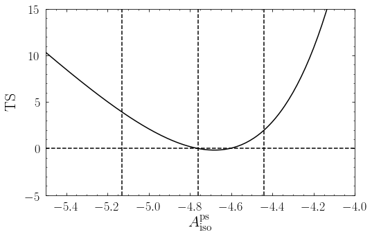
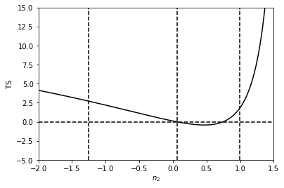

Example 7: Manual evaluation of non-Poissonian Likelihood
=========================================================

In this example we show to manually evaluate the non-Poissonian
likelihood. This can be used, for example, to interface ``nptfit`` with
parameter estimation packages other than MultiNest. We also show how to
extract the prior cube.

We will take the exact same analysis as considered in the previous
example, and show the likelihood peaks at exactly the same location for
the normalisation of the non-Poissonian template.

**NB:** This example makes use of the Fermi Data, which needs to already
be installed. See Example 1 for details.

.. code:: ipython3

    # Import relevant modules
    
    %matplotlib inline
    %load_ext autoreload
    %autoreload 2
    
    import numpy as np
    import healpy as hp
    import matplotlib.pyplot as plt
    
    from NPTFit import nptfit # module for performing scan
    from NPTFit import create_mask as cm # module for creating the mask
    from NPTFit import psf_correction as pc # module for determining the PSF correction
    from NPTFit import dnds_analysis # module for analysing the output
    
    from __future__ import print_function

Setup an identical instance of NPTFit to Example 6
--------------------------------------------------

Firstly we initialize an instance of ``nptfit`` identical to that used
in the previous example.

.. code:: ipython3

    n = nptfit.NPTF(tag='non-Poissonian_Example')

.. code:: ipython3

    fermi_data = np.load('fermi_data/fermidata_counts.npy').astype(np.int32)
    fermi_exposure = np.load('fermi_data/fermidata_exposure.npy')
    n.load_data(fermi_data, fermi_exposure)

.. code:: ipython3

    analysis_mask = cm.make_mask_total(mask_ring = True, inner = 0, outer = 5, ring_b = 90, ring_l = 0)
    n.load_mask(analysis_mask)

.. code:: ipython3

    iso_p = np.load('fermi_data/template_iso.npy')
    n.add_template(iso_p, 'iso_p')
    iso_np = np.ones(len(iso_p))
    n.add_template(iso_np, 'iso_np',units='PS')

.. code:: ipython3

    n.add_poiss_model('iso_p','$A_\mathrm{iso}$', False, fixed=True, fixed_norm=1.51)
    n.add_non_poiss_model('iso_np',
                          ['$A^\mathrm{ps}_\mathrm{iso}$','$n_1$','$n_2$','$S_b$'],
                          [[-6,1],[2.05,30],[-2,1.95]],
                          [True,False,False],
                          fixed_params = [[3,172.52]])

.. code:: ipython3

    pc_inst = pc.PSFCorrection(psf_sigma_deg=0.1812)
    f_ary = pc_inst.f_ary
    df_rho_div_f_ary = pc_inst.df_rho_div_f_ary

.. parsed-literal::

    Loading the psf correction from: /zfs/nrodd/NPTFRemakeExamples/psf_dir/gauss_128_0.181_10_50000_1000_0.01.npy

.. code:: ipython3

    n.configure_for_scan(f_ary=f_ary, df_rho_div_f_ary=df_rho_div_f_ary, nexp=1)

.. parsed-literal::

    The number of parameters to be fit is 3

Evaluate the Likelihood Manually
--------------------------------

After configuring for the scan, the instance of ``nptfit.NPTF`` now has
an associated function ``ll``. This function was passed to MultiNest in
the previous example, but we can also manually evaluate it.

The log likelihood function is called as: ``ll(theta)``, where ``theta``
is a flattened array of parameters. In the case above:

.. math::  \theta = \left[ \log_{10} \left( A^\mathrm{ps}_\mathrm{iso} \right), n_1, n_2 \right] 

As an example we can evaluate it at a few points around the best fit
parameters:

.. code:: ipython3

    print('Vary A: ', n.ll([-4.76+0.32,18.26,0.06]), n.ll([-4.76,18.26,0.06]), n.ll([-4.76-0.37,18.26,0.06]))
    print('Vary n1:', n.ll([-4.76,18.26+7.98,0.06]), n.ll([-4.76,18.26,0.06]), n.ll([-4.76,18.26-9.46,0.06]))
    print('Vary n2:', n.ll([-4.76,18.26,0.06+0.93]), n.ll([-4.76,18.26,0.06]), n.ll([-4.76,18.26,0.06-1.31]))

.. parsed-literal::

    Vary A:  -587.1163770023244 -586.2113098768381 -588.2406707060421
    Vary n1: -586.1824552299396 -586.2113098768381 -586.3726977861785
    Vary n2: -587.0768970698804 -586.2113098768381 -587.5645486197602

To make the point clearer we can fix :math:`n_1` and :math:`n_2` to
their best fit values, and calculate a Test Statistics (TS) array as we
vary :math:`\log_{10} \left( A^\mathrm{ps}_\mathrm{iso} \right)`. As
shown the likelihood is maximised at approximated where MultiNest told
us was the best fit point for this parameter.

.. code:: ipython3

    Avals = np.arange(-6.0,-2.0,0.01)
    TSvals_A = np.array([2*(n.ll([-4.76,18.26,0.06])-n.ll([Avals[i],18.26,0.06])) for i in range(len(Avals))])

.. code:: ipython3

    plt.plot(Avals,TSvals_A,color='black', lw=1.5)
    plt.axvline(-4.76+0.32,ls='dashed',color='black')
    plt.axvline(-4.76,ls='dashed',color='black')
    plt.axvline(-4.76-0.37,ls='dashed',color='black')
    plt.axhline(0,ls='dashed',color='black')
    plt.xlim([-5.5,-4.0])
    plt.ylim([-5.0,15.0])
    plt.xlabel('$A^\mathrm{ps}_\mathrm{iso}$')
    plt.ylabel('$\mathrm{TS}$')
    plt.show()

Next we do the same thing for :math:`n_2`. This time we see that this
parameter is much more poorly constrained than the value of the
normalisation, as the TS is very flat.

**NB:** it is important not to evaluate breaks exactly at a value of
:math:`n=1`. The reason for this is the analytic form of the likelihood
involves :math:`(n-1)^{-1}`.

.. code:: ipython3

    n2vals = np.arange(-1.995,1.945,0.01)
    TSvals_n2 = np.array([2*(n.ll([-4.76,18.26,0.06])-n.ll([-4.76,18.26,n2vals[i]])) for i in range(len(n2vals))])

.. code:: ipython3

    plt.plot(n2vals,TSvals_n2,color='black', lw=1.5)
    plt.axvline(0.06+0.93,ls='dashed',color='black')
    plt.axvline(0.06,ls='dashed',color='black')
    plt.axvline(0.06-1.31,ls='dashed',color='black')
    plt.axhline(0,ls='dashed',color='black')
    plt.xlim([-2.0,1.5])
    plt.ylim([-5.0,15.0])
    plt.xlabel('$n_2$')
    plt.ylabel('$\mathrm{TS}$')
    plt.show()

In general :math:`\theta` will always be a flattened array of the
floated parameters. Poisson parameters always occur first, in the order
in which they were added (via ``add_poiss_model``), following by
non-Poissonian parameters in the order they were added (via
``add_non_poiss_model``). To be explicit if we have :math:`m` Poissonian
templates and :math:`n` non-Poissonian templates with breaks
:math:`\ell_n`, then:

.. math::

    \theta = \left[ A_\mathrm{P}^1, \ldots, A_\mathrm{P}^m, A_\mathrm{NP}^1, n_1^1, \ldots, n_{\ell_1+1}^1, S_b^{(1)~1}, \ldots, S_b^{(\ell_1)~1}, \ldots, A_\mathrm{NP}^n, n_1^n, \ldots, n_{\ell_n+1}^n, S_b^{(1)~n}, \ldots, S_b^{(\ell_n)~n} \right]

Fixed parameters are deleted from the list, and any parameter entered
with a log flat prior is replaced by :math:`\log_{10}` of itself.

Extract the Prior Cube Manually
-------------------------------

To extract the prior cube, we use the internal function
``log_prior_cube``. This requires two arguments: 1. ``cube``, the unit
cube of dimension equal to the number of floated parameters; and 2.
``ndim``, the number of floated parameters.

.. code:: ipython3

    print(n.prior_cube(cube=[1,1,1],ndim=3))

.. parsed-literal::

    [1.0, 30.0, 1.9500000000000002]

