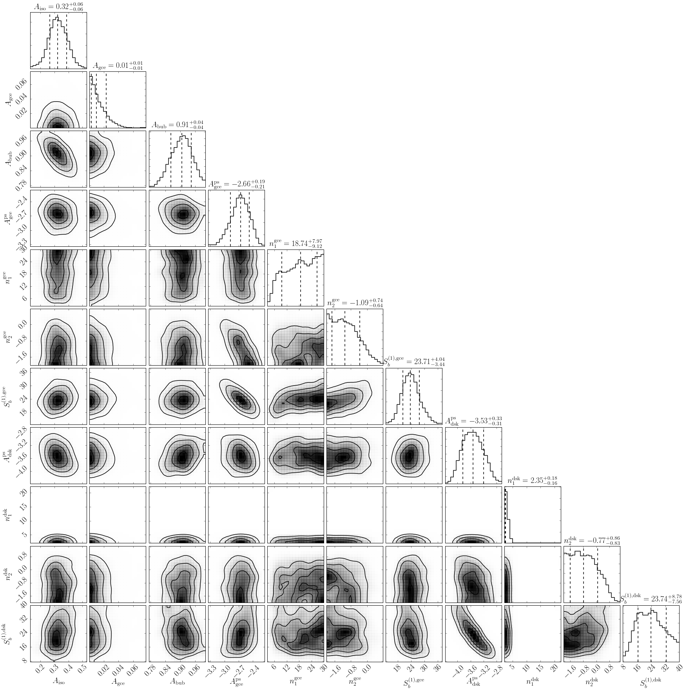
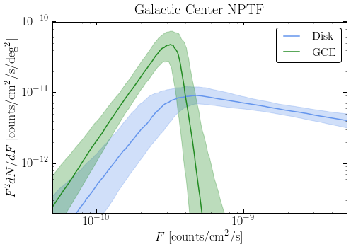
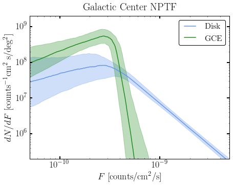
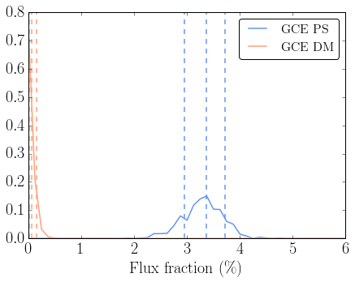
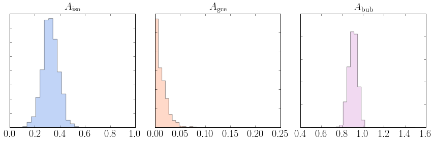
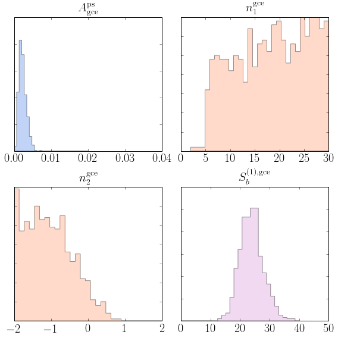

Example 8: Analyzing the Results of an NPTFit Run
=================================================

While the chain samples of a non-Poissonian fit performed using
MultiNest can be readily accessed, we provide a basic analysis module,
``dnds_analysis.py`` that contains helper functions to: 1. Make triangle
plots; 2. Get template intensities; 3. Plot source count distributions;
4. Plot flux fractions; 5. Access individual posteriors; and 6. Get
Bayesian log-evidences.

In this example we provide the details of how to use each function.

**NB:** Example 7 must be run before this notebook. Note that the run
performed there was with a low nside and a fixed diffuse model, so the
results below should be interpreted only as approximate.

.. code:: python

    # Import relevant modules
    
    %matplotlib inline
    %load_ext autoreload
    %autoreload 2
    
    import numpy as np
    import corner
    import matplotlib.pyplot as plt
    from matplotlib import rcParams
    
    import sys
    sys.path.append("../NPTFit/")
    import nptfit # module for performing scan
    import create_mask as cm # module for creating the mask
    import dnds_analysis # module for analysing the output
    import psf_correction as pc # module for determining the PSF correction

.. code:: python

    # Set plotting options
    rcParams['xtick.labelsize'] = 20
    rcParams['ytick.labelsize'] = 20
    rcParams['axes.labelsize'] = 20
    rcParams['axes.titlesize'] = 20
    rcParams['font.family'] = 'serif'
    rcParams['font.serif'] = 'CMU Serif'
    rcParams['figure.figsize'] = (7,5)
    rcParams['legend.fontsize'] = 16
    rcParams['lines.linewidth'] = 1.5
    # rcParams['text.usetex'] = True

Analysis
--------

At the outset, an instance of ``nptfit.NPTF`` must be created as was
done when initiating and performing the scan. The process here is the
same as in Example 7, up to configuring the scan. Finally, the scan is
loaded with ``n.load_scan()``.

.. code:: python

    n = nptfit.NPTF(tag='GCE_Example')

.. code:: python

    fermi_data = np.load('fermi_data/fermidata_counts.npy')
    fermi_exposure = np.load('fermi_data/fermidata_exposure.npy')
    n.load_data(fermi_data, fermi_exposure)

.. code:: python

    pscmask=np.array(np.load('fermi_data/fermidata_pscmask.npy'), dtype=bool)
    analysis_mask = cm.make_mask_total(band_mask = True, band_mask_range = 2,
                                       mask_ring = True, inner = 0, outer = 30,
                                       custom_mask = pscmask)
    n.load_mask(analysis_mask)

.. code:: python

    dif = np.load('fermi_data/template_dif.npy')
    iso = np.load('fermi_data/template_iso.npy')
    bub = np.load('fermi_data/template_bub.npy')
    gce = np.load('fermi_data/template_gce.npy')
    dsk = np.load('fermi_data/template_dsk.npy')
    
    n.add_template(dif, 'dif')
    n.add_template(iso, 'iso')
    n.add_template(bub, 'bub')
    n.add_template(gce, 'gce')
    n.add_template(dsk, 'dsk')

.. code:: python

    n.add_poiss_model('iso','$A_\mathrm{iso}$',[-2,2],False)
    n.add_poiss_model('dif','$A_\mathrm{dif}$',[-2,2],fixed=True, fixed_norm=15.)
    n.add_poiss_model('gce','$A_\mathrm{gce}$',[-2,2],False)
    n.add_poiss_model('bub','$A_\mathrm{bub}$',[-2,2],False)

.. code:: python

    n.add_non_poiss_model('gce',
                          ['$A_\mathrm{gce}^\mathrm{ps}$','$n_1^\mathrm{gce}$','$n_2^\mathrm{gce}$','$S_b^{(1), \mathrm{gce}}$'],
                          [[-6,1],[2.05,30],[-2,1.95],[0.05,40]],
                          [True,False,False,False])
    n.add_non_poiss_model('dsk',
                          ['$A_\mathrm{dsk}^\mathrm{ps}$','$n_1^\mathrm{dsk}$','$n_2^\mathrm{dsk}$','$S_b^{(1), \mathrm{dsk}}$'],
                          [[-6,1],[2.05,30],[-2,1.95],[0.05,40]],
                          [True,False,False,False])

.. code:: python

    pc_inst = pc.psf_correction(psf_sigma_deg=0.1812)
    f_ary, df_rho_div_f_ary = pc_inst.f_ary, pc_inst.df_rho_div_f_ary

.. parsed-literal::

    Loading the psf correction from: /group/hepheno/smsharma/NPTFit/examples/psf_dir/gauss_128_0.181_10_50000_1000_0.01.npy

.. code:: python

    n.configure_for_scan(f_ary, df_rho_div_f_ary, nexp=1)

.. parsed-literal::

    The number of parameters to be fit is 11

Finally, instead of running the scan we simply load the completed scan
performed in Example 7.

.. code:: python

    n.load_scan()

.. parsed-literal::

      analysing data from /group/hepheno/smsharma/NPTFit/examples/chains/GCE_Example/.txt

Analysis
--------

An instance of ``nptf.NPTF`` with a loaded scan as above can already be
used to access the posterior chains with ``n.samples``:

.. code:: python

    print np.shape(n.samples)
    print n.samples

.. parsed-literal::

    (715, 11)
    [[  2.02183174e-01   2.39669575e-02   9.79958092e-01 ...,   2.21879127e+01
        4.13248782e-01   3.89056680e+01]
     [  1.42877959e-01   1.67586387e-02   9.18143440e-01 ...,   2.39770745e+00
        1.10613478e+00   2.82342018e+01]
     [  3.13657173e-01   3.40163197e-02   9.70377300e-01 ...,   2.06343720e+00
        1.44329031e+00   2.27620469e+01]
     ..., 
     [  3.11079740e-01   1.02820464e-02   9.18678453e-01 ...,   2.35394791e+00
       -3.42663799e-01   2.52508167e+01]
     [  3.11079740e-01   1.02820464e-02   9.18678453e-01 ...,   2.35394791e+00
       -3.42663799e-01   2.52508167e+01]
     [  3.83860007e-01   1.06242110e-02   8.70613582e-01 ...,   2.23894317e+00
       -7.75741149e-01   2.91286566e+01]]

In the analysis module described next we provide basic helper functions
to load in and manipulate these chain samples.

0. Initialize Analysis Module
~~~~~~~~~~~~~~~~~~~~~~~~~~~~~

The first thing to do is initialize an instance of the analysis module,
``dnds_analysis`` from ``dnds_analysis.py`` with a provided instance of
``nptfit.NPTF``. The ``NPTF`` instance should have a scan already loaded
in, as done with ``n.load_scan()`` above.

.. code:: python

    an = dnds_analysis.dnds_analysis(n)

``dnds_analysis`` has an optional argument ``mask``, which if unset
defaults to the mask in the passed instance of ``NPTF``. If a mask is
given, however, then the analysis will be performed in a different ROI
to the main run.

1. Make triangle plots
~~~~~~~~~~~~~~~~~~~~~~

Triangle/corner plots let us visualize multidimensional samples using a
scatterplot matrix. A triangle plot with the default options can be made
as follows.

.. code:: python

    an.make_triangle()

To use your own custom plotting options, use corner as follows

.. code:: python

    corner.corner(an.nptf.samples, labels=an.nptf.params, range=[1 for i in range(an.nptf.n_params)])

with additional arguments as specified in
http://corner.readthedocs.io/en/latest/.

2. Get Intensities
~~~~~~~~~~~~~~~~~~

Template intensities can be calculated with

.. code:: python

    dnds_analysis.return_intensity_arrays_poiss(comp)
    dnds_analysis.return_intensity_arrays_non_poiss(comp)

for the Poissonian and non-Poissonian templates respectively. This
returns an intensity array corresponding to each chain sample associated
with the template ``comp``.

The NPT intensity is calculated by integrating up
:math:`\int_{S_{min}}^{S_{max}} dS~S~dN/dS`. This is approximated as a
sum between :math:`S_{min}` and :math:`S_{max}`. The options associated
with the non-Poissonian template intensity are:

+--------------+-----------------+--------------------------------------------+
| Argument     | Default Value   | Purpose                                    |
+==============+=================+============================================+
| ``comp``     | -               | The NPT key                                |
+--------------+-----------------+--------------------------------------------+
| ``smin``     | 0.01            | Minimum counts to sum up from              |
+--------------+-----------------+--------------------------------------------+
| ``smax``     | 10000           | Maximum counts to sum up to                |
+--------------+-----------------+--------------------------------------------+
| ``nsteps``   | 10000           | Number of bins in ``s`` while summing up   |
+--------------+-----------------+--------------------------------------------+

We can then look at the quantiles of this distribution, for example to
see the middle 68% along with the medians of the GCE and disk NPT as
well as that of the GCE PT:

.. code:: python

    print "GCE NPT Intensity", corner.quantile(an.return_intensity_arrays_non_poiss('gce'),[0.16,0.5,0.84]), "ph/cm^2/s"
    print "Disk NPT Intensity", corner.quantile(an.return_intensity_arrays_non_poiss('dsk'),[0.16,0.5,0.84]), "ph/cm^2/s"
    print "GCE PT Intensity", corner.quantile(an.return_intensity_arrays_poiss('gce'),[0.16,0.5,0.84]), "ph/cm^2/s"

.. parsed-literal::

    GCE NPT Intensity [  9.74733669e-08   1.11380763e-07   1.22590855e-07] ph/cm^2/s
    Disk NPT Intensity [  8.71555274e-08   1.01280005e-07   1.19953723e-07] ph/cm^2/s
    GCE PT Intensity [  5.37910482e-10   2.13377720e-09   5.04887005e-09] ph/cm^2/s

3. Plot Source Count Distributions
~~~~~~~~~~~~~~~~~~~~~~~~~~~~~~~~~~

The posterior arrays for the source count distributions :math:`dN/dF`
[counts:math:`^{-1}` cm\ :math:`^2` s deg\ :math:`^{-2}`] associated
with a given template ``comp`` at a given ``flux``
[counts/cm:math:`^2`/s] can be obtained using

.. code:: python

    dnds.return_dndf_arrays(comp,flux)

The quantiles of this can then be obtained as before. For example, the
middle 68% and medians for the GCE and disk non-Poissonian templates:

.. code:: python

    print corner.quantile(an.return_dNdF_arrays('gce',1e-12),[0.16,0.5,0.84])
    print corner.quantile(an.return_dNdF_arrays('dsk',1e-12),[0.16,0.5,0.84])

.. parsed-literal::

    [  4.85743498e+04   1.24615711e+06   6.26836117e+07]
    [  1.40610459e+04   9.75809896e+05   1.69668804e+08]

The source count distribution can be plotted with

.. code:: python

    dnds.plot_source_count_median(comp, smin, smax, nsteps, spow, **kwargs)
    dnds.plot_source_count_band(comp, smin, smax, nsteps, spow, qs, **kwargs)

The options being the same as for obtaining the NPT intensity above.
Additionally, ``spow`` is the power :math:`n` in :math:`F^ndN/dF` to
return while plotting, and ``qs`` is an array of quantiles for which to
return the dN/dF band.

.. code:: python

    an.plot_source_count_median('dsk',smin=0.01,smax=1000,nsteps=1000,color='cornflowerblue',spow=2,label='Disk')
    an.plot_source_count_band('dsk',smin=0.01,smax=1000,nsteps=1000,qs=[0.16,0.5,0.84],color='cornflowerblue',alpha=0.3,spow=2)
    
    an.plot_source_count_median('gce',smin=0.01,smax=1000,nsteps=1000,color='forestgreen',spow=2,label='GCE')
    an.plot_source_count_band('gce',smin=0.01,smax=1000,nsteps=1000,qs=[0.16,0.5,0.84],color='forestgreen',alpha=0.3,spow=2)
    
    plt.yscale('log')
    plt.xscale('log')
    plt.xlim([5e-11,5e-9])
    plt.ylim([2e-13,1e-10])
    plt.tick_params(axis='x', length=5, width=2, labelsize=18)
    plt.tick_params(axis='y', length=5, width=2, labelsize=18)
    plt.ylabel('$F^2 dN/dF$ [counts/cm$^2$/s/deg$^2$]', fontsize=18)
    plt.xlabel('$F$  [counts/cm$^2$/s]', fontsize=18)
    plt.title('Galactic Center NPTF', y=1.02)
    plt.legend(fancybox=True)
    plt.tight_layout()
    plt.savefig("GCE-NPTF-SourceCount.png")

As some references also show :math:`dN/dF` we give an example of it
below, also demonstrating the use of ``spow``.

.. code:: python

    an.plot_source_count_median('dsk',smin=0.01,smax=1000,nsteps=1000,color='cornflowerblue',spow=0,label='Disk')
    an.plot_source_count_band('dsk',smin=0.01,smax=1000,nsteps=1000,qs=[0.16,0.5,0.84],color='cornflowerblue',alpha=0.3,spow=0)
    
    an.plot_source_count_median('gce',smin=0.01,smax=1000,nsteps=1000,color='forestgreen',spow=0,label='GCE')
    an.plot_source_count_band('gce',smin=0.01,smax=1000,nsteps=1000,qs=[0.16,0.5,0.84],color='forestgreen',alpha=0.3,spow=0)
    
    plt.yscale('log')
    plt.xscale('log')
    plt.xlim([5e-11,5e-9])
    plt.ylim([2e5,2e9])
    plt.tick_params(axis='x', length=5, width=2, labelsize=18)
    plt.tick_params(axis='y', length=5, width=2, labelsize=18)
    plt.ylabel('$dN/dF$ [counts$^{-1}$cm$^2$ s/deg$^2$]', fontsize=18)
    plt.xlabel('$F$  [counts/cm$^2$/s]', fontsize=18)
    plt.title('Galactic Center NPTF', y=1.02)
    plt.legend(fancybox=True)

.. parsed-literal::

    <matplotlib.legend.Legend at 0x2b3480296550>

4. Plot Intensity Fractions
~~~~~~~~~~~~~~~~~~~~~~~~~~~

Intensity fractions (fraction of template intensity to total intensity)
for Poissonian and non-Poissonian templates respectively can be plotting
using

.. code:: python

    dnds.plot_intensity_fraction_poiss(comp, bins, **kwargs)
    dnds.plot_intensity_fraction_non_poiss(comp, bins, **kwargs)

where ``comp`` is the template key, ``bins`` is the number of bins
between 0 and 100 and ``**kwargs`` specify plotting options.

.. code:: python

    an.plot_intensity_fraction_non_poiss('gce', bins=800, color='cornflowerblue', label='GCE PS')
    an.plot_intensity_fraction_poiss('gce', bins=800, color='lightsalmon', label='GCE DM')
    plt.xlabel('Flux fraction (%)')
    plt.legend(fancybox = True)
    plt.xlim(0,6)

.. parsed-literal::

    (0, 6)

This plot makes it clear, that when given the choice, the fit prefers to
put the GCE flux into point sources rather than diffuse emission.

5. Access Parameter Posteriors
~~~~~~~~~~~~~~~~~~~~~~~~~~~~~~

While the posteriors can be accessed with ``n.samples`` (or
``an.nptf.samples``) as above, the following functions provide a useful
interfact to access individual parameters:

.. code:: python

    dnds_analysis.return_poiss_parameter_posteriors(comp)
    dnds_analysis.return_poiss_parameter_posteriors(comp)

where ``comp`` is the (non-)Poissonian template key.

Poissonian parameters
^^^^^^^^^^^^^^^^^^^^^

Posterior normalizations of Poissonian parameters can be loaded simply
as:

.. code:: python

    Aiso_poiss_post = an.return_poiss_parameter_posteriors('iso')
    Agce_poiss_post = an.return_poiss_parameter_posteriors('gce')
    Abub_poiss_post = an.return_poiss_parameter_posteriors('bub')

These can then be use in any way required, for example simply plotted:

.. code:: python

    f, axarr = plt.subplots(nrows = 1, ncols=3)
    f.set_figwidth(12)
    f.set_figheight(4)
    
    axarr[0].hist(Aiso_poiss_post, histtype='stepfilled', color='cornflowerblue', bins=np.linspace(0,1.,30), alpha=.4);
    axarr[0].set_title('$A_\mathrm{iso}$')
    axarr[1].hist(Agce_poiss_post, histtype='stepfilled', color='lightsalmon', bins=np.linspace(0,.2,30), alpha=.4);
    axarr[1].set_title('$A_\mathrm{gce}$')
    axarr[2].hist(Abub_poiss_post, histtype='stepfilled', color='plum', bins=np.linspace(.5,1.5,30), alpha=.4);
    axarr[2].set_title('$A_\mathrm{bub}$')
    
    plt.setp([a.get_yticklabels() for a in axarr], visible=False);
    
    plt.tight_layout()

Non-poissonian parameters
^^^^^^^^^^^^^^^^^^^^^^^^^

A similar syntax can be used to extract the non-Poissonian parameters.

.. code:: python

    Agce_non_poiss_post, n_non_poiss_post, Sb_non_poiss_post = an.return_non_poiss_parameter_posteriors('gce')

.. code:: python

    f, axarr = plt.subplots(2, 2);
    f.set_figwidth(8)
    f.set_figheight(8)
    
    
    axarr[0, 0].hist(Agce_non_poiss_post, histtype='stepfilled', color='cornflowerblue', bins=np.linspace(0,0.02,30), alpha=.4);
    axarr[0, 0].set_title('$A_\mathrm{gce}^\mathrm{ps}$')
    axarr[0, 1].hist(n_non_poiss_post[0], histtype='stepfilled', color='lightsalmon', bins=np.linspace(2,30,30), alpha=.4);
    axarr[0, 1].set_title('$n_1^\mathrm{gce}$')
    axarr[1, 0].hist(n_non_poiss_post[1], histtype='stepfilled', color='lightsalmon', bins=np.linspace(-2,2,30), alpha=.4);
    axarr[1, 0].set_title('$n_2^\mathrm{gce}$')
    axarr[1, 1].hist(Sb_non_poiss_post, histtype='stepfilled', color='plum', bins=np.linspace(0,40,30), alpha=.4);
    axarr[1, 1].set_title('$S_b^{(1), \mathrm{gce}}$')
    
    plt.setp(axarr[0, 0], xticks=[x*0.01 for x in range(5)])
    plt.setp(axarr[1, 0], xticks=[x*1.0-2 for x in range(5)])
    plt.setp(axarr[1, 1], xticks=[x*10 for x in range(6)])
    plt.setp([a.get_yticklabels() for a in axarr[:, 1]], visible=False);
    plt.setp([a.get_yticklabels() for a in axarr[:, 0]], visible=False);
    
    plt.tight_layout()

6. Bayesian log-evidence
~~~~~~~~~~~~~~~~~~~~~~~~

Finally the Bayesian log-evidence and associated error can be accessed
as follows.

.. code:: python

    lBE, lBE_error = an.get_log_evidence()
    print lBE, lBE_error

.. parsed-literal::

    -33479.166149 0.457762328977

