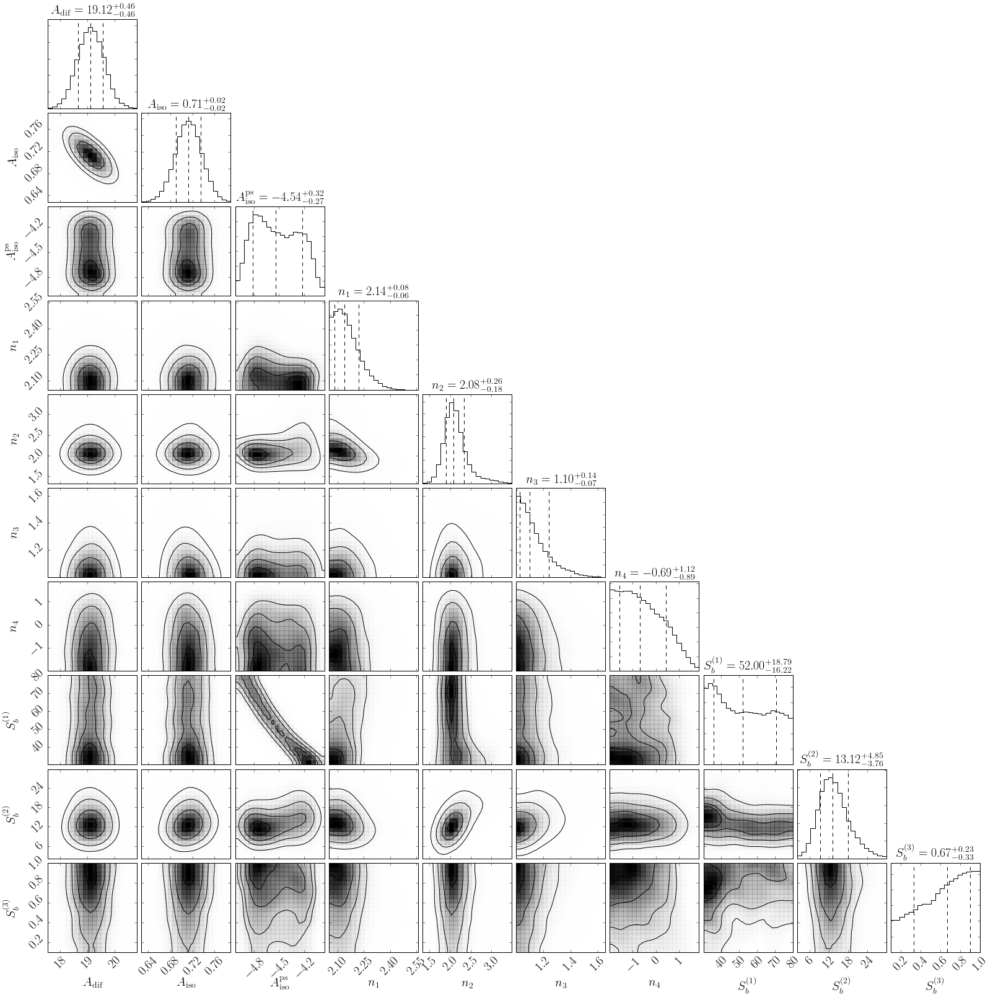
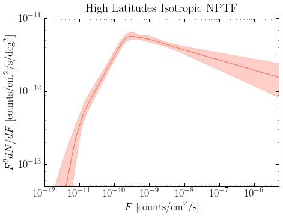
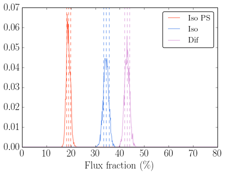
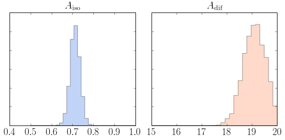
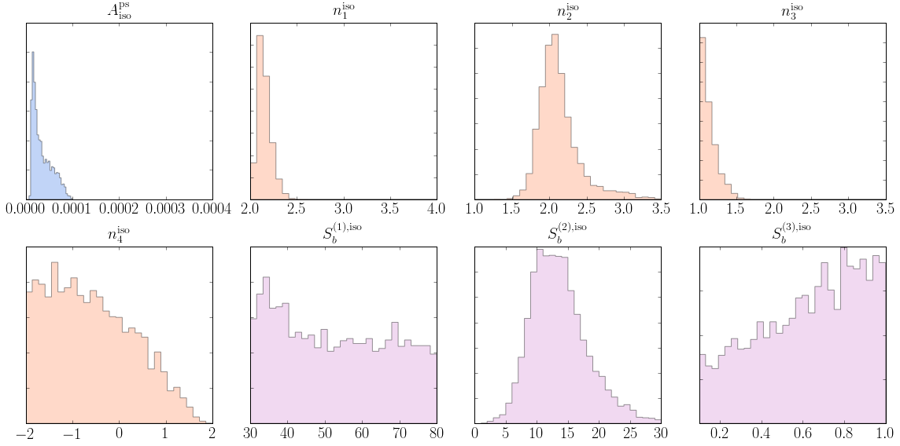

Example 9: Analyzing the Results of the High-Lat Run
====================================================

In this Example we analyze the results of an MPI run of NPTFit performed
over high latitudes.

The example batch script we provide, ``Example9_HighLat_Batch.batch`` is
for SLURM. This calls the run file ``Example9_HighLat_Run.py`` using
MPI, and is an example of how to perform a more realistic analysis using
NPTFit.

**NB:** The batch file must be run before this notebook.

**NB:** this example makes use of the Fermi Data, which needs to already
be installed. See Example 1 for details.

In this example, we model the source-count function as a triply-broken
power law. In detail, the source count function is then:

.. math::  \frac{dN}{dS} = A \left\{ \begin{array}{lc} \left( \frac{S}{S_{b,1}} \right)^{-n_1}, & S \geq S_{b,1} \\ \left(\frac{S}{S_{b,1}}\right)^{-n_2}, & S_{b,1} > S \geq S_{b,2} \\ \left( \frac{S_{b,2}}{S_{b,1}} \right)^{-n_2} \left(\frac{S}{S_{b,2}}\right)^{-n_3}, & S_{b,2} > S \geq S_{b,3} \\ \left( \frac{S_{b,2}}{S_{b,1}} \right)^{-n_2} \left( \frac{S_{b,3}}{S_{b,2}} \right)^{-n_3} \left(\frac{S}{S_{b,3}}\right)^{-n_4}, & S_{b,3} > S \end{array} \right. 

and is thereby described by the following eight parameters:

.. math::  \theta  = \left[ A, n_1, n_2, n_3, n_4, S_b^{(1)}, S_b^{(2)}, S_b^{(3)} \right]\,. 

This provides an example of a more complicated source count function,
and also explains why the run needs MPI.

.. code:: python

    # Import relevant modules
    
    %matplotlib inline
    %load_ext autoreload
    %autoreload 2
    
    import numpy as np
    import corner
    import matplotlib.pyplot as plt
    from matplotlib import rcParams
    
    from NPTFit import nptfit # module for performing scan
    from NPTFit import create_mask as cm # module for creating the mask
    from NPTFit import dnds_analysis # module for analysing the output
    from NPTFit import psf_correction as pc # module for determining the PSF correction

.. code:: python

    # Set plotting options
    rcParams['xtick.labelsize'] = 20
    rcParams['ytick.labelsize'] = 20
    rcParams['axes.labelsize'] = 20
    rcParams['axes.titlesize'] = 20
    rcParams['font.family'] = 'serif'
    rcParams['font.serif'] = 'CMU Serif'
    rcParams['figure.figsize'] = (7,5)
    rcParams['legend.fontsize'] = 16
    # rcParams['text.usetex'] = True

Load in scan
------------

We need to create an instance of ``nptfit.NPTF`` and load in the scan
performed using MPI.

.. code:: python

    n = nptfit.NPTF(tag='HighLat_Example')

.. code:: python

    fermi_data = np.load('fermi_data/fermidata_counts.npy')
    fermi_exposure = np.load('fermi_data/fermidata_exposure.npy')
    n.load_data(fermi_data, fermi_exposure)

.. code:: python

    analysis_mask = cm.make_mask_total(band_mask = True, band_mask_range = 50)
    n.load_mask(analysis_mask)

.. code:: python

    dif = np.load('fermi_data/template_dif.npy')
    iso = np.load('fermi_data/template_iso.npy')
    
    n.add_template(dif, 'dif')
    n.add_template(iso, 'iso')

.. code:: python

    n.add_poiss_model('dif','$A_\mathrm{dif}$', [0,20], False)
    n.add_poiss_model('iso','$A_\mathrm{iso}$', [0,5], False)

.. code:: python

    n.add_non_poiss_model('iso',
                          ['$A^\mathrm{ps}_\mathrm{iso}$',
                          '$n_1$','$n_2$','$n_3$','$n_4$',
                          '$S_b^{(1)}$','$S_b^{(2)}$','$S_b^{(3)}$'],
                          [[-6,2],
                          [2.05,5],[1.0,3.5],[1.0,3.5],[-1.99,1.99],
                          [30,80],[1,30],[0.1,1]],
                          [True,False,False,False,False,False,False,False])

.. code:: python

    pc_inst = pc.psf_correction(psf_sigma_deg=0.1812)
    f_ary, df_rho_div_f_ary = pc_inst.f_ary, pc_inst.df_rho_div_f_ary

.. parsed-literal::

    Loading the psf correction from: /group/hepheno/smsharma/NPTFit/examples/psf_dir/gauss_128_0.181_10_50000_1000_0.01.npy

.. code:: python

    n.configure_for_scan(f_ary=f_ary, df_rho_div_f_ary=df_rho_div_f_ary, nexp=5)

.. parsed-literal::

    The number of parameters to be fit is 10

Finally, load the completed scan performed using MPI.

.. code:: python

    n.load_scan()

.. parsed-literal::

      analysing data from /group/hepheno/smsharma/NPTFit/examples/chains/HighLat_Example/.txt

Analysis
--------

As in Example 8 we first initialize the analysis module. We will provide
the same basic plots as in that notebook, where more details on each
option is provided.

.. code:: python

    an = dnds_analysis.dnds_analysis(n)

1. Make triangle plots
~~~~~~~~~~~~~~~~~~~~~~

.. code:: python

    an.make_triangle()

2. Get Intensities
~~~~~~~~~~~~~~~~~~

.. code:: python

    print "Iso NPT Intensity",corner.quantile(an.return_intensity_arrays_non_poiss('iso'),[0.16,0.5,0.84]), "ph/cm^2/s"
    print "Iso PT Intensity",corner.quantile(an.return_intensity_arrays_poiss('iso'),[0.16,0.5,0.84]), "ph/cm^2/s"
    print "Dif PT Intensity",corner.quantile(an.return_intensity_arrays_poiss('dif'),[0.16,0.5,0.84]), "ph/cm^2/s"

.. parsed-literal::

    Iso NPT Intensity [  1.03633880e-07   1.10949453e-07   1.18316858e-07] ph/cm^2/s
    Iso PT Intensity [  1.57029120e-07   1.62092569e-07   1.67278011e-07] ph/cm^2/s
    Dif PT Intensity [  1.99021266e-07   2.03966592e-07   2.08820326e-07] ph/cm^2/s

3. Plot Source Count Distributions
~~~~~~~~~~~~~~~~~~~~~~~~~~~~~~~~~~

.. code:: python

    an.plot_source_count_median('iso',smin=0.01,smax=1000000,nsteps=10000,color='tomato',spow=2)
    an.plot_source_count_band('iso',smin=0.01,smax=1000000,nsteps=10000,qs=[0.16,0.5,0.84],color='tomato',alpha=0.3,spow=2)
    
    plt.yscale('log')
    plt.xscale('log')
    plt.xlim([1e-12,5e-6])
    plt.ylim([5e-14,1e-11])
    plt.tick_params(axis='x', length=5, width=2, labelsize=18)
    plt.tick_params(axis='y', length=5, width=2, labelsize=18)
    plt.ylabel('$F^2 dN/dF$ [counts/cm$^2$/s/deg$^2$]', fontsize=18)
    plt.xlabel('$F$  [counts/cm$^2$/s]', fontsize=18)
    plt.title('High Latitudes Isotropic NPTF', y=1.02)

.. parsed-literal::

    <matplotlib.text.Text at 0x2b3e3e637310>

4. Plot Intensity Fractions
~~~~~~~~~~~~~~~~~~~~~~~~~~~

.. code:: python

    an.plot_intensity_fraction_non_poiss('iso', bins=800, color='tomato', label='Iso PS')
    an.plot_intensity_fraction_poiss('iso', bins=800, color='cornflowerblue', label='Iso')
    an.plot_intensity_fraction_poiss('dif', bins=800, color='plum', label='Dif')
    plt.xlabel('Flux fraction (\%)')
    plt.legend(fancybox = True)
    plt.xlim(0,80)

.. parsed-literal::

    (0, 80)

5. Access Parameter Posteriors
~~~~~~~~~~~~~~~~~~~~~~~~~~~~~~

Poissonian parameters
^^^^^^^^^^^^^^^^^^^^^

.. code:: python

    Aiso_poiss_post = an.return_poiss_parameter_posteriors('iso')
    Adif_poiss_post = an.return_poiss_parameter_posteriors('dif')

.. code:: python

    f, axarr = plt.subplots(1, 2);
    f.set_figwidth(8)
    f.set_figheight(4)
    
    
    axarr[0].hist(Aiso_poiss_post, histtype='stepfilled', color='cornflowerblue', bins=np.linspace(.5,1,30),alpha=0.4);
    axarr[0].set_title('$A_\mathrm{iso}$')
    axarr[1].hist(Adif_poiss_post, histtype='stepfilled', color='lightsalmon', bins=np.linspace(15,20,30),alpha=0.4);
    axarr[1].set_title('$A_\mathrm{dif}$')
    
    plt.setp([a.get_yticklabels() for a in axarr[:]], visible=False);
    
    plt.tight_layout()

Non-poissonian parameters
^^^^^^^^^^^^^^^^^^^^^^^^^

.. code:: python

    Aiso_non_poiss_post, n_non_poiss_post, Sb_non_poiss_post = an.return_non_poiss_parameter_posteriors('iso')

.. code:: python

    f, axarr = plt.subplots(2, 4);
    f.set_figwidth(16)
    f.set_figheight(8)
    
    axarr[0, 0].hist(Aiso_non_poiss_post, histtype='stepfilled', color='cornflowerblue', bins=np.linspace(0,.0001,30),alpha=0.4);
    axarr[0, 0].set_title('$A_\mathrm{iso}^\mathrm{ps}$')
    axarr[0, 1].hist(n_non_poiss_post[0], histtype='stepfilled', color='lightsalmon', bins=np.linspace(2,4,30),alpha=0.4);
    axarr[0, 1].set_title('$n_1^\mathrm{iso}$')
    axarr[0, 2].hist(n_non_poiss_post[1], histtype='stepfilled', color='lightsalmon', bins=np.linspace(1,3.5,30),alpha=0.4);
    axarr[0, 2].set_title('$n_2^\mathrm{iso}$')
    axarr[0, 3].hist(n_non_poiss_post[2], histtype='stepfilled', color='lightsalmon', bins=np.linspace(1,3.5,30),alpha=0.4);
    axarr[0, 3].set_title('$n_3^\mathrm{iso}$')
    axarr[1, 0].hist(n_non_poiss_post[3], histtype='stepfilled', color='lightsalmon', bins=np.linspace(-2,2,30),alpha=0.4);
    axarr[1, 0].set_title('$n_4^\mathrm{iso}$')
    axarr[1, 1].hist(Sb_non_poiss_post[0], histtype='stepfilled', color='plum', bins=np.linspace(30,80,30),alpha=0.4);
    axarr[1, 1].set_title('$S_b^{(1), \mathrm{iso}}$')
    axarr[1, 2].hist(Sb_non_poiss_post[1], histtype='stepfilled', color='plum', bins=np.linspace(1,30,30),alpha=0.4);
    axarr[1, 2].set_title('$S_b^{(2), \mathrm{iso}}$')
    axarr[1, 3].hist(Sb_non_poiss_post[2], histtype='stepfilled', color='plum', bins=np.linspace(0.1,1,30),alpha=0.4);
    axarr[1, 3].set_title('$S_b^{(3), \mathrm{iso}}$')
    
    plt.setp(axarr[0, 0], xticks=[x*.0001 for x in range(5)])
    plt.setp(axarr[1, 0], xticks=[x*1.-2.0 for x in range(5)])
    plt.setp(axarr[1, 3], xticks=[x*0.2+0.2 for x in range(5)])
    plt.setp([a.get_yticklabels() for a in axarr[:, 0]], visible=False);
    plt.setp([a.get_yticklabels() for a in axarr[:, 1]], visible=False);
    plt.setp([a.get_yticklabels() for a in axarr[:, 2]], visible=False);
    plt.setp([a.get_yticklabels() for a in axarr[:, 3]], visible=False);
    plt.tight_layout()

